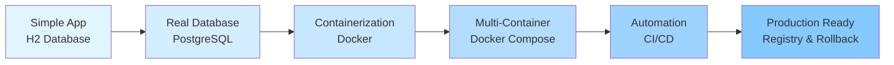

# 📘 From H2 to Production-Grade CI/CD with Docker & GitHub Actions

> **A comprehensive, step-by-step journey from a simple Spring Boot + H2 application to a fully Dockerized system with CI, image registry, and rollback-ready deployments.**

---

## 📋 Table of Contents

1. [Who This Is For](#-who-this-is-for)
2. [Learning Philosophy](#-learning-philosophy)
3. [Chapter Overview](#-chapter-overview)
4. [Chapter 1: The Baseline - Spring Boot + H2](#chapter-1--the-baseline-spring-boot--h2)
5. [Chapter 2: Migrating to PostgreSQL](#chapter-2--migrating-from-h2-to-postgresql-local-setup)
6. [Chapter 3: Introduction to Docker](#chapter-3--introduction-to-docker-concepts-first-tools-later)
7. [Chapter 4: Dockerizing the Application](#chapter-4--dockerizing-the-application-dockerfile--real-failures)
8. [Chapter 5: Docker Compose](#chapter-5--docker-compose-multi-container-setup--networking)
9. [Chapter 6: Continuous Integration Concepts](#chapter-6--continuous-integration-concepts-first)
10. [Chapter 7: Implementing CI with GitHub Actions](#chapter-7--github-actions-implementing-ci-build--verify-only)
11. [Chapter 8: Docker Registry](#chapter-8--docker-registry-why-images-need-a-home)
12. [Chapter 9: Integrating CI with GHCR](#chapter-9--integrating-ci-with-github-container-registry-ghcr)
13. [Chapter 10: Deployment & Rollback Strategy](#chapter-10--deployment-using-ci-built-images--rollback-strategy-conceptual)
14. [Final Takeaways](#-final-takeaways)
15. [What This Prepares You For](#-what-this-prepares-you-for)

---

## 🎯 Who This Is For

This documentation is designed for developers who:

- ✅ Can already build small Spring Boot applications
- ✅ Have used H2 or simple databases
- ✅ Want to **understand how real backend systems are built**
- ✅ Want to think like a **developer in a real team**, not just follow tutorials
- ✅ Are transitioning from tutorial projects to production-ready systems

**What you'll gain:**
- Deep understanding of the **why** behind every architectural decision
- Practical experience with **real failures** and how to solve them
- **System-level thinking** that goes beyond coding tutorials
- Production-ready skills valued by engineering teams

---

## 🧭 Learning Philosophy

This guide follows a unique approach:

### Core Principles

```
┌─────────────────────────────────────────────────────────┐
│  1. Step-by-step progression (no big jumps)            │
│  2. Failures are learning milestones (not mistakes)    │
│  3. Every command answers WHY, not just HOW            │
│  4. Tools explained in context (when needed)           │
│  5. Focus on system thinking (not tool memorization)   │
└─────────────────────────────────────────────────────────┘
```

### Learning Path Visualization



---

## 📂 Chapter Overview

| Chapter | Topic | Key Learnings |
|---------|-------|---------------|
| **1** | Spring Boot + H2 | Application logic validation, in-memory databases |
| **2** | PostgreSQL Migration | Real databases, persistence, networking basics |
| **3** | Docker Concepts | Images vs containers, reproducibility |
| **4** | Dockerizing the App | Dockerfile creation, container isolation |
| **5** | Docker Compose | Multi-container orchestration, networking |
| **6** | CI Concepts | Automation, verification, team workflows |
| **7** | GitHub Actions | Implementing CI, workflow automation |
| **8** | Docker Registry | Artifact storage, versioning |
| **9** | CI + GHCR Integration | Complete CI/CD pipeline |
| **10** | Deployment & Rollback | Production strategies, operational safety |

---

# Chapter 1 — The Baseline: Spring Boot + H2

## 1.1 Why Start with H2

### The First Principle: Separate Concerns

When starting a backend application, the first objective is **validating application logic**, not infrastructure.

**At this stage, we want to answer:**

```
┌─────────────────────────────────────────────┐
│  ✓ Are the APIs correct?                   │
│  ✓ Are entities mapped properly?           │
│  ✓ Is the service logic correct?           │
│  ✓ Can we iterate quickly?                 │
└─────────────────────────────────────────────┘
```

### What is H2?

**H2 is an in-memory database** that runs inside the same JVM as the Spring Boot application.

```
┌──────────────────────────────────────────────────┐
│         Spring Boot Application (JVM)           │
│                                                  │
│  ┌────────────────┐      ┌─────────────────┐   │
│  │   Your Code    │ ───► │   H2 Database   │   │
│  │  (Controllers, │      │   (In-Memory)   │   │
│  │   Services)    │ ◄─── │                 │   │
│  └────────────────┘      └─────────────────┘   │
│                                                  │
│  Everything runs in one process                 │
└──────────────────────────────────────────────────┘
```

**Key characteristics:**
- ❌ No installation required
- ❌ No networking configuration
- ❌ No authentication setup
- ✅ Perfect for rapid development
- ✅ Ideal for validating business logic

> **Important Insight:** Starting with H2 allows us to **separate application correctness from system complexity**.

---

## 1.2 Initial Application Design

The project is a **simple Library Management System**, intentionally kept small to focus on system-level concepts rather than complex business logic.

### Core Features

```
┌─────────────────────────────────────────┐
│         Book Management API            │
├─────────────────────────────────────────┤
│  ➤ Add a book                          │
│  ➤ Fetch all books                     │
│  ➤ Fetch book by ID                    │
│  ➤ Update a book                       │
│  ➤ Delete a book                       │
│  ➤ Search books by title or author    │
└─────────────────────────────────────────┘
```

### Project Structure: Layered Architecture

```
src/main/java/
├── controller/     ──► HTTP request handling
├── service/        ──► Business logic
├── repository/     ──► Data persistence (JPA)
├── entity/         ──► Database table mapping
└── dto/            ──► Request/Response objects

┌─────────────┐
│  Controller │  ──► Handles HTTP requests/responses
└──────┬──────┘
       │
       ▼
┌─────────────┐
│   Service   │  ──► Contains business logic
└──────┬──────┘
       │
       ▼
┌─────────────┐
│ Repository  │  ──► Interacts with database
└──────┬──────┘
       │
       ▼
┌─────────────┐
│  Database   │  ──► Stores data
└─────────────┘
```

**Why this structure matters:**
- Mirrors **real-world backend services**
- Enables **easy testing** of individual layers
- Prepares for **future scaling** and complexity
- Industry-standard pattern recognized by teams

---

## 1.3 H2 Configuration (application.yml)

At this stage, the database configuration is intentionally **simple and minimal**.

```yaml
spring:
  datasource:
    url: jdbc:h2:mem:bookdb
    driver-class-class: org.h2.Driver
    username: sa
    password: ""

  jpa:
    database-platform: org.hibernate.dialect.H2Dialect
    hibernate:
      ddl-auto: update
    show-sql: true

  h2:
    console:
      enabled: true
      path: /h2-console

server:
  port: 8080
```

---

## 1.4 Explanation of the Configuration

### 🔹 Datasource URL

```yaml
spring.datasource.url: jdbc:h2:mem:bookdb
```

**Breaking it down:**
- `jdbc:h2` → Uses H2 database driver
- `mem` → **In-memory mode** (data exists only while app runs)
- `bookdb` → Database name

```
Application Start          Application Running          Application Stop
     │                            │                            │
     ▼                            ▼                            ▼
┌─────────┐              ┌─────────────────┐           ┌─────────┐
│ No Data │  ────────►   │  Database with  │  ───────► │ No Data │
│         │              │  tables & data  │           │         │
└─────────┘              └─────────────────┘           └─────────┘
```

> ⚠️ **Critical:** Every restart = fresh database

---

### 🔹 Driver Class

```yaml
driver-class-name: org.h2.Driver
```

- JDBC driver required for H2 connectivity
- Automatically included when H2 dependency is in `pom.xml`

---

### 🔹 Credentials

```yaml
username: sa
password: ""
```

- Default H2 credentials
- No authentication complexity at this stage
- Focus remains on application logic

---

### 🔹 JPA & Hibernate Configuration

```yaml
jpa:
  database-platform: org.hibernate.dialect.H2Dialect
  hibernate:
    ddl-auto: update
  show-sql: true
```

#### **ddl-auto: update**

```
Application Startup
      │
      ▼
┌──────────────────────────────────────┐
│  Hibernate scans @Entity classes    │
└───────────────┬──────────────────────┘
                │
                ▼
┌──────────────────────────────────────┐
│  Compares with existing tables       │
└───────────────┬──────────────────────┘
                │
                ▼
┌──────────────────────────────────────┐
│  Creates missing tables              │
│  Adds missing columns                │
│  (Does NOT delete anything)          │
└──────────────────────────────────────┘
```

**Why this is ideal for development:**
- ✅ Automatic schema creation
- ✅ No manual SQL needed
- ✅ Supports rapid iteration
- ⚠️ **Avoided in production** (data safety reasons)

---

#### **show-sql: true**

```yaml
show-sql: true
```

**What this does:**
Prints SQL queries in console logs

**Example output:**
```sql
Hibernate: 
    insert 
    into
        book
        (author, title, id) 
    values
        (?, ?, ?)
```

**Benefits:**
- 🔍 Understand how JPA translates to SQL
- 🐛 Debug query issues
- 📚 Learn SQL through observation

---

#### **database-platform: H2Dialect**

```yaml
database-platform: org.hibernate.dialect.H2Dialect
```

- Optimizes SQL generation for H2
- Ensures correct syntax
- Different databases have different dialects:
  - H2 → `H2Dialect`
  - PostgreSQL → `PostgreSQLDialect`
  - MySQL → `MySQLDialect`

---

### 🔹 H2 Console

```yaml
h2:
  console:
    enabled: true
    path: /h2-console
```

**Accessing the console:**
```
http://localhost:8080/h2-console
```

**Login credentials:**
```
JDBC URL: jdbc:h2:mem:bookdb
Username: sa
Password: (leave blank)
```

**What you can do:**

```
┌────────────────────────────────────┐
│        H2 Console Browser         │
├────────────────────────────────────┤
│  ► View all tables                │
│  ► Execute SQL queries            │
│  ► Inspect table structure        │
│  ► Verify data insertion          │
│  ► Debug query results            │
└────────────────────────────────────┘
```

---

## 1.5 What Worked Well with H2

### Advantages During Early Development

```
✅ Zero setup required
   └─► No installation, no configuration files

✅ Instant feedback loop
   └─► Code → Run → See results (seconds)

✅ Easy schema recreation
   └─► Just restart the application

✅ Clear visibility into SQL
   └─► Learn how JPA works under the hood

✅ Focus on business logic
   └─► No infrastructure distractions
```

**Real-world scenario:**
```
Day 1: Create entity ──► Table appears automatically
Day 2: Add column   ──► Schema updates on restart
Day 3: Test API     ──► Data visible in H2 console
Day 4: Fix bug      ──► Clean state after restart
```

H2 allowed the application to reach **functional stability quickly**.

---

## 1.6 Limitations Discovered with H2

While H2 is excellent for early development, it exposed important limitations:

### ❌ No Data Persistence

```
┌──────────────┐         ┌──────────────┐         ┌──────────────┐
│ Add 100 books│   ─────►│  Restart App │   ─────►│  0 books     │
└──────────────┘         └──────────────┘         └──────────────┘
```

**Impact:** Cannot test real-world scenarios requiring data survival

---

### ❌ Non-Production Behavior

**SQL Differences Example:**

| Feature | H2 | PostgreSQL | Impact |
|---------|-----|------------|--------|
| String comparison | Case-insensitive by default | Case-sensitive | Query results differ |
| Date functions | Limited | Rich | Complex queries fail |
| JSON support | Basic | Advanced | Feature gaps |

**The danger:**
```
Works in H2 ──► Deploy to PostgreSQL ──► Breaks in production
```

---

### ❌ No External Dependency Simulation

```
Real Systems:
┌─────────────┐      Network      ┌──────────────┐
│ Application │ ◄─────────────► │  Database    │
└─────────────┘   (can fail)     └──────────────┘

H2 Setup:
┌─────────────────────────────────────┐
│  Application + Database (same JVM) │
│  (network failures impossible)      │
└─────────────────────────────────────┘
```

**What's missing:**
- Network latency
- Connection timeouts
- Authentication failures
- Network partitions

---

### ❌ False Confidence Risk

```
Scenario: "My app works perfectly!"
  └─► Tested only with H2
  └─► Deployed to production
  └─► PostgreSQL behaves differently
  └─► Application crashes
```

> **Key Learning:** Success with H2 does **not** guarantee production readiness.

---

## 1.7 Why This Step Was Necessary

Starting with H2 helped achieve:

```
┌──────────────────────────────────────────────┐
│  Phase 1: Validate Core Logic               │
├──────────────────────────────────────────────┤
│  ✓ API endpoints work correctly             │
│  ✓ JPA mappings are valid                   │
│  ✓ Service layer logic is sound             │
│  ✓ Request/Response flow is correct         │
└──────────────────────────────────────────────┘
         │
         ▼
┌──────────────────────────────────────────────┐
│  Phase 2: Reduce Debugging Surface          │
├──────────────────────────────────────────────┤
│  ✓ No infrastructure confusion              │
│  ✓ No database setup errors                 │
│  ✓ No network issues                        │
│  ✓ Focus purely on code quality             │
└──────────────────────────────────────────────┘
```

**Critical principle:**
> Future failures will be **system-related**, not **application-related**, because application logic is already validated.

---

## 1.8 Outcome of Chapter 1

By the end of this stage:

| Area | Status |
|------|--------|
| CRUD APIs | ✅ All endpoints working |
| JPA Mappings | ✅ Validated and tested |
| Application Structure | ✅ Stable and organized |
| Database Interactions | ✅ Fully understood |
| In-memory Limitations | ✅ Clearly identified |

**What we built:**

```
┌────────────────────────────────────────┐
│    Solid Application Foundation        │
├────────────────────────────────────────┤
│  • Clean architecture                  │
│  • Working business logic              │
│  • Validated data layer                │
│  • Understood SQL behavior             │
│  • Ready for real database             │
└────────────────────────────────────────┘
```

---

## 1.9 Transition to the Next Chapter

### The Natural Next Question

```
Current State:
  ✓ Application logic works
  ✓ H2 database works
  ✓ Development is fast

New Question:
  ❓ How does this behave with a REAL, external database?
```

**This question requires:**
- ✦ Persistence across restarts
- ✦ Network-based connections
- ✦ Authentication and security
- ✦ Real-world failure scenarios

**This transition leads to Chapter 2: PostgreSQL Migration**

---

---

# Chapter 2 — Migrating from H2 to PostgreSQL (Local Setup)

## 2.1 Why Move Away from H2

After validating application logic with H2, the next step is testing against a **real, external database**.

### Real Systems vs H2

```
┌─────────────────────────────────────────────────────────┐
│              Real Production Systems                    │
├─────────────────────────────────────────────────────────┤
│  ✦ Databases run as SEPARATE services                  │
│  ✦ Data PERSISTS across restarts                       │
│  ✦ Connections happen over NETWORK ports               │
│  ✦ Authentication and configuration MATTER             │
└─────────────────────────────────────────────────────────┘

┌─────────────────────────────────────────────────────────┐
│                  H2 In-Memory                           │
├─────────────────────────────────────────────────────────┤
│  ✗ Runs inside application JVM                         │
│  ✗ Data disappears on restart                          │
│  ✗ No network involved                                 │
│  ✗ No real authentication                              │
└─────────────────────────────────────────────────────────┘
```

> **Key Insight:** H2 hides all system complexity. To move closer to real-world backend development, we migrate to PostgreSQL.

---

## 2.2 Installing PostgreSQL Locally

PostgreSQL was installed locally using the official installer.

### Post-Installation State

```
┌────────────────────────────────────────┐
│      Your Local Machine                │
├────────────────────────────────────────┤
│  ✓ PostgreSQL service running          │
│  ✓ Listening on port 5432              │
│  ✓ pgAdmin installed (GUI tool)        │
│  ✓ Ready to create databases           │
└────────────────────────────────────────┘
```

**What changed:**
- Database is now a **background service**
- **Separate process** from your application
- Accessible via **network connection** (even though it's on localhost)

> **Focus shift:** At this stage, we're not writing SQL commands. We're focusing on **correct configuration** and **connectivity**.

---

## 2.3 Creating the Database using pgAdmin

Instead of using SQL commands, the database was created using **pgAdmin** (PostgreSQL's graphical management tool).

### Steps in pgAdmin

```
┌─────────────────────────────────────────────────────────┐
│                pgAdmin Interface                        │
├─────────────────────────────────────────────────────────┤
│                                                         │
│  1. Open pgAdmin                                        │
│     │                                                   │
│     ▼                                                   │
│  2. Connect to local PostgreSQL server                 │
│     │                                                   │
│     ▼                                                   │
│  3. Right-click "Databases"                            │
│     │                                                   │
│     ▼                                                   │
│  4. Click "Create" → "Database"                        │
│     │                                                   │
│     ▼                                                   │
│  5. Enter database name: "book"                        │
│     │                                                   │
│     ▼                                                   │
│  6. Click "Save"                                       │
│                                                         │
└─────────────────────────────────────────────────────────┘
```

**What you didn't need to create:**
- ❌ Special users
- ❌ Custom roles
- ❌ Permissions
- ❌ Schemas (uses `public` by default)

**The only requirement:**
```
Database name in pgAdmin  =  Database name in Spring Boot config
         ↓                              ↓
       "book"                         "book"
```

---

## 2.4 Key Concept: Database Name Matching

### Critical Understanding

```
┌──────────────────────────────────────────────────────────┐
│  Spring Boot DOES NOT care how database was created     │
├──────────────────────────────────────────────────────────┤
│                                                          │
│  Spring Boot only cares that:                           │
│    ✓ The database EXISTS                                │
│    ✓ The NAME matches config                           │
│    ✓ Credentials are CORRECT                           │
│    ✓ Database is REACHABLE                             │
│                                                          │
└──────────────────────────────────────────────────────────┘
```

### Multiple Ways to Create Database (All Valid)

```
Method 1: pgAdmin (GUI)          ┐
Method 2: psql (CLI commands)    ├─► All produce same result
Method 3: Docker                 │
Method 4: Cloud Console          ┘

        ↓
┌─────────────────────┐
│  Database: "book"   │  ◄─── Application connects here
└─────────────────────┘
```

**This abstraction is intentional** and mirrors real-world development where:
- Developers use GUI tools
- Scripts use CLI commands
- Prod uses cloud services
- **Application code remains the same**

---

## 2.5 Updating application.yml for PostgreSQL

The H2 configuration is now **replaced** with PostgreSQL configuration.

### Updated Configuration

```yaml
spring:
  datasource:
    url: jdbc:postgresql://localhost:5432/book
    username: postgres
    password: passPost
    driver-class-name: org.postgresql.Driver

  jpa:
    hibernate:
      ddl-auto: update
    show-sql: true

server:
  port: 8080
```

---

## 2.6 Explanation of Configuration

### 🔹 JDBC URL

```yaml
spring.datasource.url: jdbc:postgresql://localhost:5432/book
```

**Breaking it down:**

```
jdbc:postgresql://localhost:5432/book
│    │            │         │     │
│    │            │         │     └─► Database name
│    │            │         └───────► Port number
│    │            └─────────────────► Host (local machine)
│    └──────────────────────────────► Database type
└───────────────────────────────────► Protocol
```

**Connection flow:**

```
Application                    PostgreSQL Service
    │                                │
    │  jdbc:postgresql://localhost:5432/book
    ├──────────────────────────────► │
    │                                │
    │  Connection established        │
    │ ◄──────────────────────────────┤
    │                                │
    │  Query: SELECT * FROM book     │
    ├──────────────────────────────► │
    │                                │
    │  Result set                    │
    │ ◄──────────────────────────────┤
```

**If database name doesn't match:**

```
Config says: "book"
pgAdmin has: "library"
            ↓
Application fails at startup
            ↓
Error: database "book" does not exist
```

---

### 🔹 Credentials

```yaml
username: postgres
password: passPost
```

**Important differences from H2:**

| Aspect | H2 | PostgreSQL |
|--------|-----|------------|
| Authentication | Optional | **Mandatory** |
| Default user | `sa` | `postgres` |
| Password | Empty string OK | Must match installation |
| Security | Development only | Production-grade |

**What happens with wrong credentials:**

```
Application Startup
      │
      ▼
Connecting to database...
      │
      ▼
❌ FATAL: password authentication failed for user "postgres"
      │
      ▼
Application fails to start
```

---

### 🔹 Hibernate Behavior

```yaml
hibernate:
  ddl-auto: update
```

**What happens now:**

```
Application Startup
      │
      ▼
┌────────────────────────────────────┐
│ Hibernate connects to PostgreSQL  │
└──────────────┬─────────────────────┘
               │
               ▼
┌────────────────────────────────────┐
│ Scans @Entity classes              │
└──────────────┬─────────────────────┘
               │
               ▼
┌────────────────────────────────────┐
│ Compares with existing tables      │
│ in "book" database                 │
└──────────────┬─────────────────────┘
               │
               ▼
┌────────────────────────────────────┐
│ Creates missing tables             │
│ Updates schema if needed           │
└────────────────────────────────────┘
```

**Benefit:** Smooth migration without manual SQL at this stage.

---

## 2.7 First Application Run with PostgreSQL

### Running the Application

```bash
mvn spring-boot:run
```

### Expected Behavior

```
Console Output:

  .   ____          _            __ _ _
 /\\ / ___'_ __ _ _(_)_ __  __ _ \ \ \ \
( ( )\___ | '_ | '_| | '_ \/ _` | \ \ \ \
 \\/  ___)| |_)| | | | | || (_| |  ) ) ) )
  '  |____| .__|_| |_|_| |_\__, | / / / /
 =========|_|==============|___/=/_/_/_/
 :: Spring Boot ::                (v3.x.x)

2024-01-15 INFO  Starting Application...
2024-01-15 INFO  HikariPool-1 - Starting...
2024-01-15 INFO  HikariPool-1 - Start completed.

┌──────────────────────────────────────────────────┐
│ ✓ Database JDBC URL:                            │
│   jdbc:postgresql://localhost:5432/book         │
│                                                  │
│ ✓ Database version: PostgreSQL 17.x             │
│                                                  │
│ ✓ Hibernate: created tables                     │
└──────────────────────────────────────────────────┘

2024-01-15 INFO  Tomcat started on port 8080
2024-01-15 INFO  Application started successfully
```

### Verification in pgAdmin

```
pgAdmin → Databases → book → Schemas → public → Tables
                                                  │
                                                  ▼
                                            ┌──────────┐
                                            │  book    │
                                            └──────────┘
                                                  
Table created automatically by Hibernate!
```

---

## 2.8 Common Issues Encountered

### ❌ Issue 1: Database Does Not Exist

**Error:**
```
org.postgresql.util.PSQLException: 
FATAL: database "book" does not exist
```

**Root cause:**
```
application.yml          pgAdmin
     │                      │
database: "book"      database: "library"
     │                      │
     └──────────────────────┘
           Mismatch!
```

**Fix:**
```bash
# Option 1: Rename in pgAdmin
pgAdmin → Rename database to "book"

# Option 2: Update application.yml
spring.datasource.url: jdbc:postgresql://localhost:5432/library
```

---

### ❌ Issue 2: Connection Refused

**Error:**
```
Connection to localhost:5432 refused
```

**Diagnostic flow:**

```
Check 1: Is PostgreSQL service running?
   │
   ├─► Windows: Services → PostgreSQL
   ├─► Mac: brew services list
   └─► Linux: systemctl status postgresql
         │
         ├─► Running ✓  → Check next
         └─► Stopped ✗  → Start service
                            │
                            ▼
Check 2: Is port 5432 listening?
   │
   └─► netstat -an | grep 5432
         │
         ├─► Found ✓    → Check next
         └─► Not found ✗ → Check PostgreSQL config
                            │
                            ▼
Check 3: Can pgAdmin connect?
   │
   └─► Try connecting in pgAdmin
         │
         ├─► Success ✓  → Issue is in Spring config
         └─► Fails ✗    → PostgreSQL installation issue
```

**Fix:**
```bash
# Start PostgreSQL service
# Windows
net start postgresql-x64-17

# Mac
brew services start postgresql

# Linux
sudo systemctl start postgresql
```

---

### ❌ Issue 3: Authentication Failed

**Error:**
```
org.postgresql.util.PSQLException: 
FATAL: password authentication failed for user "postgres"
```

**What's happening:**

```
application.yml
   │
   └─► password: "wrongPassword"
             │
             ▼
        PostgreSQL
             │
             ▼
        ❌ Password mismatch
             │
             ▼
     Connection rejected
```

**Fix:**
```yaml
# Use the SAME password you set during PostgreSQL installation
spring:
  datasource:
    password: passPost  # ← Must match your installation
```

**How to reset password (if forgotten):**
```sql
-- In psql or pgAdmin
ALTER USER postgres PASSWORD 'newPassword';
```

---

## 2.9 Verifying Persistence (Key Difference from H2)

### The Persistence Test

**Step-by-step verification:**

```
Step 1: Add records using API
┌──────────────────────────────────────┐
│ POST /api/books                      │
│ {                                    │
│   "title": "Clean Code",             │
│   "author": "Robert Martin"          │
│ }                                    │
└──────────────────────────────────────┘
      │
      ▼
   200 OK
      │
      ▼
Step 2: Verify data exists
┌──────────────────────────────────────┐
│ GET /api/books                       │
└──────────────────────────────────────┘
      │
      ▼
  [{ "id": 1, "title": "Clean Code", ... }]
      │
      ▼
Step 3: STOP the Spring Boot application
┌──────────────────────────────────────┐
│ Ctrl+C (or stop in IDE)              │
└──────────────────────────────────────┘
      │
      ▼
Step 4: RESTART the application
┌──────────────────────────────────────┐
│ mvn spring-boot:run                  │
└──────────────────────────────────────┘
      │
      ▼
Step 5: Fetch records again
┌──────────────────────────────────────┐
│ GET /api/books                       │
└──────────────────────────────────────┘
      │
      ▼
✓ Data still exists!
  [{ "id": 1, "title": "Clean Code", ... }]
```

**Comparison with H2:**

```
H2 Behavior:
  Add data → Restart → ❌ Data gone

PostgreSQL Behavior:
  Add data → Restart → ✓ Data persists
```

**This confirms:**
- Database is **stateful**
- Data survives application lifecycle
- **Real persistence** mechanism working

---

## 2.10 Conceptual Shift at This Stage

### Major Mindset Change

```
┌────────────────────────────────────────────────────┐
│              BEFORE (H2)                           │
├────────────────────────────────────────────────────┤
│  • Database is part of the application            │
│  • No external dependencies                        │
│  • Failures are always in your code               │
│  • Configuration is simple                         │
└────────────────────────────────────────────────────┘
                      │
                      ▼
         Migration to PostgreSQL
                      │
                      ▼
┌────────────────────────────────────────────────────┐
│              AFTER (PostgreSQL)                    │
├────────────────────────────────────────────────────┤
│  • Database is a SEPARATE system                  │
│  • Application DEPENDS on external service        │
│  • Failures can occur OUTSIDE your code           │
│  • Configuration correctness is CRITICAL          │
└────────────────────────────────────────────────────┘
```

### New Failure Modes

```
Possible Failures:
  ✗ Database service down
  ✗ Network connectivity issues
  ✗ Wrong credentials
  ✗ Port conflicts
  ✗ Firewall blocking connection
  ✗ Database doesn't exist
  ✗ Permissions issues
```

**This is how real backend services behave.**

---

## 2.11 Outcome of Chapter 2

### What We Achieved

| Component | Status |
|-----------|--------|
| Application | ✅ Runs with PostgreSQL |
| Database | ✅ Persistent and external |
| Configuration | ✅ Externalized and correct |
| Connection Issues | ✅ Understood and debugged |
| Data Persistence | ✅ Verified across restarts |

### System Architecture Now

```
┌─────────────────────┐         ┌──────────────────────┐
│                     │         │                      │
│  Spring Boot App    │ ◄─────► │  PostgreSQL          │
│  (Port 8080)        │  JDBC   │  (Port 5432)         │
│                     │         │                      │
└─────────────────────┘         └──────────────────────┘
     Your Code                   External Service
     (Process 1)                 (Process 2)
```

### Confidence Gained

```
✓ App works beyond H2
✓ Real database integration successful
✓ Network-based connections working
✓ Authentication mechanisms understood
✓ Persistence verified
✓ Foundation ready for containerization
```

---

## 2.12 Transition to the Next Chapter

### The New Challenge

```
Current Achievement:
  ✓ Application works locally
  ✓ PostgreSQL works locally
  ✓ Everything runs on YOUR machine

New Question:
  ❓ How do we ensure this setup works the SAME WAY
     on EVERY machine?
```

**The problem:**

```
Your Machine          Teammate's Machine      CI Server
     │                      │                      │
     ✓ Java 17             ? Java 11              ? Java 8
     ✓ PostgreSQL 17       ? PostgreSQL 15        ? Not installed
     ✓ Port 5432 free      ? Port in use          ? Unknown
     ✓ Correct password    ? Different password   ? No database
     │                      │                      │
     └──────────────────────┴──────────────────────┘
                          "It works on my machine!"
```

**Solution required:**
- ✦ Package dependencies together
- ✦ Environment isolation
- ✦ Reproducibility guarantee
- ✦ Consistent behavior everywhere

**This leads to Chapter 3: Docker**

---

---

# Chapter 3 — Introduction to Docker (Concepts First, Tools Later)

## 3.1 The Problem We Are Trying to Solve

### Current State Assessment

```
┌────────────────────────────────────────────────────┐
│  Our Application Today                             │
├────────────────────────────────────────────────────┤
│  ✓ Works with PostgreSQL                          │
│  ✓ Runs correctly on local machine                │
│  ✓ Depends on specific environment setup          │
└────────────────────────────────────────────────────┘
```

### Dependencies Required to Run

```
┌─────────────────────────────────────────────┐
│  Required Software Stack                    │
├─────────────────────────────────────────────┤
│  1. Java (correct version - 17)            │
│  2. Maven (for building)                    │
│  3. PostgreSQL (installed & running)        │
│  4. Correct database credentials            │
│  5. Correct port configuration (5432, 8080) │
└─────────────────────────────────────────────┘
```

**If ANY ONE of these differs, the application fails.**

---

### The "Works on My Machine" Problem

```
Developer A's Machine
┌──────────────────────┐
│ ✓ Java 17            │
│ ✓ PostgreSQL 17      │
│ ✓ Port 5432 free     │
│ → App works!         │
└──────────────────────┘

Developer B's Machine
┌──────────────────────┐
│ ✗ Java 11            │
│ ✓ PostgreSQL 15      │
│ ✗ Port 5432 busy     │
│ → App fails!         │
└──────────────────────┘

CI Server
┌──────────────────────┐
│ ? Java version       │
│ ✗ No PostgreSQL      │
│ ✗ No database setup  │
│ → Cannot even start! │
└──────────────────────┘
```

**This creates the infamous real-world problem:**
> "It works on my machine, but not on yours."

**Docker exists to solve exactly this problem.**

---

## 3.2 What Docker Actually Is (Simple Explanation)

### What Docker is NOT

```
❌ Docker is NOT a programming language
❌ Docker is NOT a framework
❌ Docker is NOT a replacement for Java or Spring Boot
❌ Docker is NOT a virtual machine (though similar concept)
```

### What Docker IS

```
Docker is a way to package an application 
together with everything it needs to run.
```

### The Shipping Container Analogy

```
Before Containers (Chaos):
┌─────────────────────────────────────────────────┐
│  Ship 1: Boxes, barrels, crates (all different) │
│  Ship 2: Different sizes, different handling    │
│  Ship 3: Incompatible with Ship 1 & 2          │
└─────────────────────────────────────────────────┘
      Problems: Damage, loss, slow loading

After Containers (Standardized):
┌─────────────────────────────────────────────────┐
│  All goods in STANDARD CONTAINERS               │
│  Same size, same handling, any cargo            │
│  Works on any ship, any truck, any crane        │
└─────────────────────────────────────────────────┘
      Benefits: Fast, safe, predictable
```

**Docker does the same for software:**

```
┌──────────────────────────────────────────┐
│         Standardized Box Contains:       │
├──────────────────────────────────────────┤
│  • Your application code                 │
│  • Java runtime                          │
│  • Required libraries                    │
│  • Configuration files                   │
│  • Environment variables                 │
└──────────────────────────────────────────┘
           │
           ▼
    Works Identically On:
      • Developer laptop
      • Teammate's computer
      • CI server
      • Production server
      • Cloud platform
```

---

## 3.3 Image vs Container (Most Important Concept)

### Critical Distinction

```
┌─────────────────────────────────────────────────┐
│          DOCKER IMAGE                           │
├─────────────────────────────────────────────────┤
│  • Blueprint / Template                         │
│  • Read-only                                    │
│  • Created once                                 │
│  • Stored in registry                           │
│  • Can be versioned                             │
│                                                 │
│  Analogy: Like a CLASS in Java                  │
└─────────────────────────────────────────────────┘
           │
           │ docker run
           ▼
┌─────────────────────────────────────────────────┐
│          DOCKER CONTAINER                       │
├─────────────────────────────────────────────────┤
│  • Running instance of an image                 │
│  • Has state while running                      │
│  • Can be started, stopped, deleted             │
│  • Isolated from other containers               │
│  • Temporary (unless volumes used)              │
│                                                 │
│  Analogy: Like an OBJECT from a class           │
└─────────────────────────────────────────────────┘
```

### Visual Representation

```
Image: book-app:v1
    │
    ├─► docker run ──► Container 1 (running on port 8080)
    │
    ├─► docker run ──► Container 2 (running on port 8081)
    │
    └─► docker run ──► Container 3 (running on port 8082)

One image ──► Many containers
```

### Why This Matters

```
Scenario: Destroy a container
  │
  ├─► Container deleted
  ├─► Data inside container lost (unless volume)
  └─► Image remains untouched
        │
        └─► Can create new container anytime
```

**Key principle:**
> Containers are **disposable**. Images are **permanent** (until explicitly deleted).

---

## 3.4 Why Docker Is Needed Even If the App Already Works

### Before Docker

```
Setup Process:
1. Install Java 17
2. Install Maven
3. Install PostgreSQL
4. Configure database
5. Set environment variables
6. Build application
7. Run application
8. Hope it works!

┌────────────────────────────────────┐
│  Developer A does this             │
│  Developer B does this differently │
│  CI server does it another way     │
│  Results: Inconsistent             │
└────────────────────────────────────┘
```

**Problems:**
- ❌ Manual setup (error-prone)
- ❌ Environment differences
- ❌ Undocumented dependencies
- ❌ "Works on my machine" syndrome
- ❌ Onboarding new developers is painful

---

### After Docker

```
Setup Process:
1. Install Docker
2. Run: docker run book-app
3. Done!

┌────────────────────────────────────┐
│  Everyone runs the SAME command    │
│  Same result on ALL machines       │
│  Environment is BUILT-IN           │
│  Zero configuration needed         │
└────────────────────────────────────┘
```

**Benefits:**
- ✅ One-command setup
- ✅ Identical environments
- ✅ Self-documented dependencies
- ✅ Onboarding in minutes
- ✅ Reproducible builds

---

### The Mindset Shift

```
FROM: "How do I set up my machine?"
   ↓
TO:   "Just run the container."
```

**Real-world impact:**

```
Old way:
  New developer joins → 2 days to set up environment

Docker way:
  New developer joins → 5 minutes to run application
```

---

## 3.5 What a Dockerfile Is (Conceptual)

### Definition

```
A Dockerfile is:
  • A text file
  • A set of instructions
  • Tells Docker HOW to build an image
```

### What It Answers

```
Questions a Dockerfile answers:
  1. What base environment is needed?
     └─► "Start from Java 17"
  
  2. What files should be included?
     └─► "Copy my JAR file"
  
  3. What command should run the app?
     └─► "Execute: java -jar app.jar"
```

### Critical Understanding

```
┌───────────────────────────────────────────┐
│  A Dockerfile does NOT run your app.      │
│  It DEFINES how to build the image.       │
└───────────────────────────────────────────┘

Dockerfile ──build──► Image ──run──► Container
   (recipe)            (result)      (running app)
```

### Example Structure (Preview)

```dockerfile
# What to start from
FROM java:17

# Where to work
WORKDIR /app

# What to copy
COPY app.jar /app/

# How to run
CMD ["java", "-jar", "app.jar"]
```

---

## 3.6 Why We Don't Jump into Dockerfile Immediately

### The Learning Anti-Pattern

```
❌ Bad Approach:
   └─► "Here's a Dockerfile, copy-paste it"
        │
        ├─► No understanding of images
        ├─► No understanding of containers
        ├─► No understanding of dependencies
        └─► Result: Blind copy-pasting
                     │
                     └─► Confusing failures
                          │
                          └─► Zero learning
```

### The Correct Approach (This Guide)

```
✅ Good Approach:
   1. App works            ← Chapter 1-2
   2. Database works       ← Chapter 2
   3. Pain is real         ← "Works on my machine" problem
   4. Solution is clear    ← "We need reproducibility"
   5. THEN learn Docker    ← You are here
```

**Why this order matters:**
- You understand the **problem** before learning the **solution**
- You know **why** Docker exists
- You can **debug** when things break
- You build **mental models**, not recipes

---

## 3.7 Docker Does NOT Replace the Database

### Common Misconception

```
❌ WRONG: "Docker replaces PostgreSQL"
✅ RIGHT: "Docker packages PostgreSQL"
```

### Clarification

```
PostgreSQL will still:
  • Run as a separate process
  • Have its own lifecycle
  • Have persistent storage
  • Listen on network ports

Docker just makes it:
  • Consistent across machines
  • Version-controlled
  • Isolated from host system
  • Reproducible
```

### Visual

```
Without Docker:
┌────────────┐         ┌─────────────┐
│ Your App   │ ◄─────► │ PostgreSQL  │
│ (Manual)   │         │ (Manual)    │
└────────────┘         └─────────────┘

With Docker:
┌─────────────────┐         ┌──────────────────────┐
│ Your App        │         │ PostgreSQL           │
│ (in Container)  │ ◄─────► │ (in Container)       │
└─────────────────┘         └──────────────────────┘
  Still separate processes, just containerized
```

**Key insight:** Docker doesn't change what your app needs. It changes how those needs are packaged.

---

## 3.8 Localhost Is About to Break (Important Warning)

### Current Working Setup

```yaml
# application.yml (works now)
spring:
  datasource:
    url: jdbc:postgresql://localhost:5432/book
```

```
Your Machine:
┌──────────────────────────────────────┐
│                                      │
│  ┌───────────┐     ┌──────────────┐ │
│  │    App    │────►│  PostgreSQL  │ │
│  └───────────┘     └──────────────┘ │
│                                      │
│  localhost means "this machine"     │
└──────────────────────────────────────┘
```

---

### After Docker (What Changes)

```
Your Machine:
┌──────────────────────────────────────────────┐
│                                              │
│  Container 1          Container 2            │
│  ┌───────────┐       ┌──────────────┐       │
│  │    App    │  ???  │  PostgreSQL  │       │
│  └───────────┘       └──────────────┘       │
│       │                                      │
│       │  localhost:5432                      │
│       └─────────►  ❌ Nothing listening!     │
│                                              │
│  "localhost" inside container ≠ host machine│
└──────────────────────────────────────────────┘
```

**The problem:**
- Inside a container, `localhost` means **inside that container**
- PostgreSQL is in a **different** container
- Connection **fails**

**Why this warning now:**
- Understanding this **before** writing Dockerfile prevents confusion
- We'll fix this in Chapter 5 with Docker Compose networking

---

## 3.9 Mental Model Shift Introduced by Docker

### Transformation of Thinking

```
┌────────────────────────────────────────────────┐
│         BEFORE DOCKER                          │
├────────────────────────────────────────────────┤
│  "My app is code"                              │
│  "I run my code"                               │
│  "Environments are manual"                     │
│  "Infrastructure is someone else's problem"    │
└────────────────────────────────────────────────┘
                     │
                     ▼
              Docker Introduction
                     │
                     ▼
┌────────────────────────────────────────────────┐
│         AFTER DOCKER                           │
├────────────────────────────────────────────────┤
│  "My app is an artifact"                       │
│  "I run a system"                              │
│  "Infrastructure is reproducible"              │
│  "Environment is code"                         │
└────────────────────────────────────────────────┘
```

### Levels of Abstraction

```
Level 1: Code
  └─► "I wrote a Java application"

Level 2: Build
  └─► "I packaged it as a JAR"

Level 3: Runtime
  └─► "I run it with Java"

Level 4: System (Docker)
  └─► "I containerized it with its environment"

Level 5: Orchestration (Future)
  └─► "I deploy it across multiple machines"
```

**This is a major step from "I run my app" to "I run a system".**

---

## 3.10 Outcome of Chapter 3

### What You Now Understand

```
✓ Why Docker exists (solve environment inconsistency)
✓ What problems it solves (reproducibility)
✓ Image vs Container (blueprint vs instance)
✓ What Dockerfiles do (define how to build images)
✓ Why Docker comes after database setup (logical progression)
✓ How Docker fits into real development (system thinking)
✓ What will break (localhost networking)
```

### What You Don't Know Yet (Intentionally)

```
✗ Dockerfile syntax
✗ Docker commands
✗ Container networking
✗ Volume management
✗ Multi-container setup
```

**This is deliberate.**

> **Philosophy:** Understanding comes before tooling. Concepts before commands.

---

## 3.11 Transition to the Next Chapter

### The Natural Next Question

```
Current Understanding:
  ✓ Docker packages apps with their environment
  ✓ Images are blueprints, containers are instances
  ✓ This solves "works on my machine" problem

New Question:
  ❓ How do we package OUR Spring Boot application
     into a Docker image?
```

**This requires:**
- ✦ Understanding JAR packaging
- ✦ Writing a Dockerfile
- ✦ Handling common Docker mistakes
- ✦ Dealing with real failures

**Which is exactly the focus of Chapter 4 — Dockerizing the Application**

---

---

# Chapter 4 — Dockerizing the Application (Dockerfile + Real Failures)

## 4.1 What "Dockerizing" Actually Means

### Clarifying Misconceptions

```
❌ Dockerizing does NOT mean:
   ├─► Rewriting code
   ├─► Changing business logic
   ├─► Replacing Spring Boot
   └─► Making the app "Docker-aware"

✅ Dockerizing DOES mean:
   └─► Packaging the application exactly as it runs,
       along with everything it needs,
       into a Docker image
```

### Current State

```
┌────────────────────────────────────┐
│  What Already Works:               │
├────────────────────────────────────┤
│  ✓ Application logic               │
│  ✓ PostgreSQL connection           │
│  ✓ All APIs functional             │
└────────────────────────────────────┘
```

**Goal:** Reproducibility, not new features

---

## 4.2 Understanding the JAR File (Before Dockerfile)

### What is a JAR?

```
JAR = Java ARchive
  │
  ├─► A packaged Java application
  ├─► Contains compiled classes (.class files)
  ├─► Contains dependencies (libraries)
  ├─► Contains resources (application.yml, etc.)
  └─► Executable via: java -jar app.jar
```

### JAR vs WAR

| Aspect | JAR | WAR |
|--------|-----|-----|
| **Stands for** | Java ARchive | Web ARchive |
| **Contains** | Standalone app | Web app |
| **Server** | Embedded (Tomcat) | External (Tomcat, Jetty) |
| **Deployment** | `java -jar app.jar` | Copy to server /webapps |
| **Use case** | Microservices, containers | Traditional app servers |

**Why JAR for this project:**
- Spring Boot **embeds Tomcat**
- No external application server needed
- **Perfect for containerized deployments**
- Modern microservice pattern

---

## 4.3 Creating the JAR (First Required Step)

### The Build Command

```bash
mvn clean package -DskipTests
```

### Breaking Down the Command

```
mvn clean package -DskipTests
│   │     │        │
│   │     │        └─► Skip test execution
│   │     │
│   │     └─► Build JAR file
│   │
│   └─► Remove old builds
│
└─► Maven command
```

### What Happens During Build

```
Step 1: clean
┌────────────────────────────────────┐
│ Delete target/ directory           │
│ Remove old builds                  │
└────────────────────────────────────┘
         │
         ▼
Step 2: compile
┌────────────────────────────────────┐
│ Compile .java → .class files       │
│ Process resources                  │
└────────────────────────────────────┘
         │
         ▼
Step 3: package
┌────────────────────────────────────┐
│ Bundle everything into JAR         │
│ Add dependencies                   │
│ Create executable structure        │
└────────────────────────────────────┘
         │
         ▼
Output:
target/libraryManagementSystem-0.0.1-SNAPSHOT.jar
```

### Why Skip Tests?

```
-DskipTests flag

Reason at this stage:
  ├─► Tests require database connection
  ├─► PostgreSQL not available in build environment
  └─► Would cause build failure

Better approach (later):
  └─► Use in-memory database for tests
      or test containers
```

### Verifying the JAR

```bash
# Check if JAR was created
ls -lh target/*.jar

# Example output:
-rw-r--r-- 1 user group 45M Jan 15 10:30 libraryManagementSystem-0.0.1-SNAPSHOT.jar
```

**This JAR becomes the input for Docker.**

---

## 4.4 First Dockerfile (Initial Attempt)

### Creating the Dockerfile

```
Project root/
├── src/
├── target/
│   └── libraryManagementSystem-0.0.1-SNAPSHOT.jar
├── pom.xml
└── Dockerfile  ← Create this file
```

### Initial Dockerfile Content

```dockerfile
FROM eclipse-temurin:17-jre
WORKDIR /app
COPY target/*.jar app.jar
ENTRYPOINT ["java", "-jar", "app.jar"]
```

---

## 4.5 Explanation of Each Line

### 🔹 Line 1: Base Image

```dockerfile
FROM eclipse-temurin:17-jre
```

**What this does:**

```
Downloads and uses this image as foundation:
┌────────────────────────────────────────┐
│  Eclipse Temurin Java 17 Runtime      │
├────────────────────────────────────────┤
│  • Based on Linux (Ubuntu)            │
│  • Java 17 JRE pre-installed          │
│  • Lightweight (no JDK)               │
│  • Optimized for containers           │
└────────────────────────────────────────┘
```

**Why this base image:**
- ✅ Official OpenJDK distribution
- ✅ Matches project Java version (17)
- ✅ `jre` (not `jdk`) → smaller image size
- ✅ Well-maintained and secure

**JRE vs JDK:**

```
JDK (Java Development Kit)
  ├─► Includes compiler (javac)
  ├─► Includes debugging tools
  ├─► Includes JRE
  └─► Larger size (~300MB+)

JRE (Java Runtime Environment)
  ├─► Only runtime (java)
  ├─► No compiler
  ├─► No development tools
  └─► Smaller size (~150MB)

For running JAR: JRE is sufficient ✓
```

---

### 🔹 Line 2: Working Directory

```dockerfile
WORKDIR /app
```

**What this creates:**

```
Container filesystem:
/
├── bin/
├── etc/
├── usr/
├── var/
└── app/  ← Our working directory
    └── (future files go here)
```

**Benefits:**
- Avoids hard-coded paths
- Cleaner file organization
- All subsequent commands use this as base

**Without WORKDIR:**

```dockerfile
COPY target/*.jar /some/path/app.jar
ENTRYPOINT ["java", "-jar", "/some/path/app.jar"]
```

**With WORKDIR:**

```dockerfile
WORKDIR /app
COPY target/*.jar app.jar
ENTRYPOINT ["java", "-jar", "app.jar"]
```

---

### 🔹 Line 3: Copy JAR

```dockerfile
COPY target/*.jar app.jar
```

**What this does:**

```
Host Machine                Container
┌────────────────┐         ┌────────────────┐
│ target/        │         │ /app/          │
│  ├─ *.jar      │  ────►  │  └─ app.jar    │
└────────────────┘         └────────────────┘
```

**Breakdown:**
- `target/*.jar` → Source path (host)
- `app.jar` → Destination name (container)
- `*` wildcard matches JAR file
- Renames to simple `app.jar`

**Why rename:**
- Simplifies ENTRYPOINT command
- Avoids long snapshot names
- Cleaner container structure

---

### 🔹 Line 4: Startup Command

```dockerfile
ENTRYPOINT ["java", "-jar", "app.jar"]
```

**Exec form (recommended):**

```dockerfile
ENTRYPOINT ["executable", "param1", "param2"]
         │
         └─► JSON array format
```

**What happens when container starts:**

```
Container Start
      │
      ▼
Execute: java -jar app.jar
      │
      ▼
Spring Boot application starts
      │
      ▼
Tomcat listens on port 8080
```

**ENTRYPOINT vs CMD:**

| Aspect | ENTRYPOINT | CMD |
|--------|------------|-----|
| **Purpose** | Main command | Default arguments |
| **Override** | Requires `--entrypoint` | Easy to override |
| **Use case** | Fixed command | Configurable args |

**For running apps, ENTRYPOINT is preferred.**

---

## 4.6 First Docker Build Command

### Building the Image

```bash
docker build -t book:0 .
```

### Command Breakdown

```
docker build -t book:0 .
│      │      │  │     │  │
│      │      │  │     │  └─► Context (current directory)
│      │      │  │     └────► Version tag
│      │      │  └──────────► Image name
│      │      └─────────────► Tag flag
│      └────────────────────► Build subcommand
└───────────────────────────► Docker CLI
```

### Build Process Visualization

```
Step 1/4: FROM eclipse-temurin:17-jre
 ──► Pulling base image (if not cached)
     ✓ Downloaded

Step 2/4: WORKDIR /app
 ──► Creating directory
     ✓ Complete

Step 3/4: COPY target/*.jar app.jar
 ──► Copying JAR file
     ✓ Complete

Step 4/4: ENTRYPOINT ["java", "-jar", "app.jar"]
 ──► Setting startup command
     ✓ Complete

Successfully built abc123def456
Successfully tagged book:0
```

### Verifying Image Creation

```bash
docker images | grep book

# Output:
REPOSITORY   TAG   IMAGE ID       CREATED         SIZE
book         0     abc123def456   2 minutes ago   350MB
```

**At this point:**
- ✅ Image exists
- ✅ Tagged as `book:0`
- ❓ Not yet tested

---

## 4.7 First Failure: "Unable to access jarfile"

### Attempting to Run

```bash
docker run -p 8080:8080 book:0
```

### Error Encountered

```
Error: Unable to access jarfile target/*.jar
```

### Why This Happened

```
Docker Build Environment:
┌─────────────────────────────────────┐
│  Isolated build context             │
│                                     │
│  What Docker can see:               │
│    ✓ Dockerfile                     │
│    ✓ Files in current directory     │
│                                     │
│  What Docker CANNOT see:            │
│    ✗ Files outside context          │
│    ✗ Maven build process            │
│    ✗ Compile-time tools             │
└─────────────────────────────────────┘
```

**The problem:**

```
Dockerfile says:
  COPY target/*.jar app.jar

But if target/ directory is empty or JAR doesn't exist:
  ❌ COPY fails
  ❌ Nothing to copy
  ❌ Container has no JAR file
```

### Root Cause

```
Assumption: JAR exists
Reality:    JAR not built yet
Result:     Docker cannot copy what doesn't exist
```

---

### Fix: Ensuring JAR Exists

```bash
# Step 1: Build JAR
mvn clean package -DskipTests

# Output:
[INFO] Building jar: target/libraryManagementSystem-0.0.1-SNAPSHOT.jar
[INFO] BUILD SUCCESS

# Step 2: Verify JAR exists
ls target/*.jar

# Step 3: Rebuild Docker image
docker build -t book:0 .

# This time:
Step 3/4: COPY target/*.jar app.jar
 ──► 45.2MB copied  ✓
```

### Lesson Learned

```
┌─────────────────────────────────────────┐
│  Critical Docker Principle              │
├─────────────────────────────────────────┤
│  Docker builds images in ISOLATION      │
│  Docker does NOT run Maven              │
│  Docker does NOT compile code           │
│  Docker only COPIES existing files      │
│                                         │
│  Therefore:                             │
│  Build artifacts BEFORE Docker build    │
└─────────────────────────────────────────┘
```

---

## 4.8 Running the Container (Second Failure)

### Attempting to Run Again

```bash
docker run -p 8080:8080 book:0
```

### Error Encountered

```
org.postgresql.util.PSQLException: 
Connection to localhost:5432 refused
```

### What's Happening

```
Container Environment:
┌──────────────────────────────────────┐
│  Container: book-app                 │
│                                      │
│  App tries to connect:               │
│  jdbc:postgresql://localhost:5432   │
│        │                             │
│        ▼                             │
│  "localhost" means INSIDE container  │
│        │                             │
│        ▼                             │
│  No PostgreSQL inside this container │
│        │                             │
│        ▼                             │
│  ❌ Connection refused               │
└──────────────────────────────────────┘

Host Machine:
┌──────────────────────────────────────┐
│  PostgreSQL running on port 5432     │
│  (Outside container)                 │
└──────────────────────────────────────┘
```

---

## 4.9 Why This Failure Happened (Critical Concept)

### Container Network Isolation

```
┌────────────────────────────────────────────────┐
│               Your Computer                    │
├────────────────────────────────────────────────┤
│                                                │
│  ┌──────────────────┐  ┌──────────────────┐   │
│  │  Container       │  │  Host System     │   │
│  │                  │  │                  │   │
│  │  localhost =     │  │  localhost =     │   │
│  │  this container  │  │  this machine    │   │
│  │                  │  │                  │   │
│  │  No PostgreSQL   │  │  PostgreSQL ✓    │   │
│  └──────────────────┘  └──────────────────┘   │
│         │                      │               │
│         └──────────────────────┘               │
│           Different "localhost"                │
└────────────────────────────────────────────────┘
```

### The Networking Problem

```
application.yml (current):
spring:
  datasource:
    url: jdbc:postgresql://localhost:5432/book
                          ↑
                    This is the problem

Inside container:
  localhost → 127.0.0.1 of container
  PostgreSQL is NOT there

PostgreSQL is running:
  On the HOST machine
  Not accessible via "localhost" from container
```

---

## 4.10 Why This Was NOT Fixed Immediately

### Intentional Learning Progression

```
Current Goal:
  ✓ Dockerize the APPLICATION only
  ✗ Not solving multi-container communication yet

Why:
  ├─► Focus on one problem at a time
  ├─► Understand container isolation
  └─► Prepare for Docker Compose

Next Stage Will Address:
  ├─► Multiple containers
  ├─► Container networking
  ├─► Service discovery
  └─► Docker Compose orchestration
```

### What Was Achieved

```
✓ Application successfully packaged into Docker image
✓ Dockerfile understood line-by-line
✓ JAR build process integrated
✓ Real Docker failures encountered and understood
✗ Networking issue identified (to be solved in Chapter 5)
```

**This failure is expected and intentional — it's a learning milestone.**

---

## 4.11 Key Learnings from These Failures

### From "JAR Not Found" Failure

```
Lesson 1: Docker Builds Are Isolated
  ├─► Docker doesn't run Maven
  ├─► Docker doesn't compile code
  ├─► Docker only copies existing files
  └─► Build artifacts BEFORE Docker build
```

### From "Connection Refused" Failure

```
Lesson 2: Container Networking Is Isolated
  ├─► localhost inside container ≠ localhost on host
  ├─► Containers cannot access host by default
  ├─► Multi-container apps need special networking
  └─► Docker Compose solves this (next chapter)
```

### From General Experience

```
Lesson 3: Dockerization Exposes Hidden Assumptions
  ├─► "JAR exists" (assumption)
  ├─► "localhost works" (assumption)
  └─► Docker forces explicit configuration
```

### Philosophy

```
┌─────────────────────────────────────────────┐
│  These failures are NOT mistakes            │
│  They are LEARNING MILESTONES               │
│                                             │
│  Each failure teaches:                      │
│    • How Docker works                       │
│    • What isolation means                   │
│    • Why each step matters                  │
└─────────────────────────────────────────────┘
```

---

## 4.12 Outcome of Chapter 4

### What We Built

```
Dockerfile:
┌──────────────────────────────────────────┐
│ FROM eclipse-temurin:17-jre              │
│ WORKDIR /app                             │
│ COPY target/*.jar app.jar                │
│ ENTRYPOINT ["java", "-jar", "app.jar"]  │
└──────────────────────────────────────────┘
         │
         ▼
Docker Image: book:0
         │
         ▼
Can create containers (though networking broken)
```

### What We Learned

| Concept | Understanding |
|---------|---------------|
| JAR packaging | ✅ Fully understood |
| Dockerfile syntax | ✅ Line-by-line clarity |
| Docker build process | ✅ Step-by-step knowledge |
| Container isolation | ✅ Networking limitations clear |
| Common failures | ✅ Encountered and explained |

### Current State

```
Application Layer:    ✅ Dockerized
Database Layer:       ❌ Not yet connected
Networking:          ❌ Isolated containers
Multi-container:     ❌ Not yet addressed
```

---

## 4.13 Transition to the Next Chapter

### The Obvious Next Question

```
Current Status:
  ✓ Application runs in a container
  ✓ PostgreSQL runs separately
  ✗ They cannot communicate

New Question:
  ❓ How do we run the application and database
     together correctly?
```

**Requirements to solve this:**
- ✦ Multiple containers running simultaneously
- ✦ Networking between containers
- ✦ Persistent data storage
- ✦ Coordinated startup/shutdown

**This leads directly to:**

---

**Chapter 5 — Docker Compose (Multi-Container Setup & Networking)**

---


# Chapter 5 — Docker Compose (Multi-Container Setup & Networking)

## 5.1 Why Docker Compose Is Needed

After Dockerizing the application, a major limitation became clear:

```
Current Situation:
┌────────────────────────────────────────┐
│  Application → runs in Container A    │
│  PostgreSQL  → runs outside containers │
│  Result      → Cannot communicate      │
└────────────────────────────────────────┘
```

### The Real-World Pattern

```
In production systems:
  ✦ Applications rarely run alone
  ✦ They depend on:
      ├─► Databases
      ├─► Caches (Redis)
      ├─► Message queues (RabbitMQ, Kafka)
      ├─► Other microservices
      └─► Monitoring tools
```

### Manual Multi-Container Nightmare

**Without Docker Compose:**

```bash
# Terminal 1: Create network
docker network create myapp-network

# Terminal 2: Start PostgreSQL
docker run -d \
  --name postgres \
  --network myapp-network \
  -e POSTGRES_DB=book \
  -e POSTGRES_USER=postgres \
  -e POSTGRES_PASSWORD=passPost \
  -p 5432:5432 \
  postgres:17

# Terminal 3: Start application
docker run -d \
  --name book-app \
  --network myapp-network \
  -e SPRING_DATASOURCE_URL=jdbc:postgresql://postgres:5432/book \
  -e SPRING_DATASOURCE_USERNAME=postgres \
  -e SPRING_DATASOURCE_PASSWORD=passPost \
  -p 8080:8080 \
  book:0

# To stop:
docker stop book-app postgres
docker rm book-app postgres
docker network rm myapp-network
```

**Problems:**
- ❌ Multiple commands to remember
- ❌ Easy to forget steps
- ❌ Error-prone
- ❌ Difficult to share with team
- ❌ No version control

**Docker Compose exists to solve this exact problem.**

---

## 5.2 What Docker Compose Actually Is

### Definition

```
Docker Compose is:
  • A tool for defining multi-container applications
  • Uses a single YAML configuration file
  • Manages container lifecycle together
  • Handles networking automatically
  • Coordinates startup and shutdown
```

### The Power of Declarative Configuration

```
Instead of:
  "Run this command, then this, then this..."

You write:
  "This is what my system looks like"

Docker Compose:
  "I'll make it happen"
```

### What Compose Manages

```
┌────────────────────────────────────────┐
│      Docker Compose Orchestrates:      │
├────────────────────────────────────────┤
│  ✦ Multiple containers                 │
│  ✦ Networks between them               │
│  ✦ Volumes for persistence             │
│  ✦ Environment variables               │
│  ✦ Dependencies (startup order)        │
│  ✦ Port mappings                       │
└────────────────────────────────────────┘
```

---

## 5.3 Introducing the Compose File

### File Location

```
Project Structure:
project-root/
├── src/
├── target/
├── Dockerfile
├── pom.xml
└── docker-compose.yml  ← Create this
```

### What It Describes

```
docker-compose.yml answers:
  1. What services exist?
  2. How do they connect?
  3. What environment variables do they need?
  4. What data should persist?
  5. Which ports are exposed?
```

---

## 5.4 Full docker-compose.yml

```yaml
services:
  postgres:
    image: postgres:17
    container_name: book-postgres
    restart: always
    environment:
      POSTGRES_DB: book
      POSTGRES_USER: postgres
      POSTGRES_PASSWORD: passPost
    volumes:
      - postgres_data:/var/lib/postgresql/data
    ports:
      - "5432:5432"

  app:
    image: book:0
    container_name: book-app
    restart: always
    depends_on:
      - postgres
    ports:
      - "8080:8080"
    environment:
      SPRING_DATASOURCE_URL: jdbc:postgresql://postgres:5432/book
      SPRING_DATASOURCE_USERNAME: postgres
      SPRING_DATASOURCE_PASSWORD: passPost

volumes:
  postgres_data:
```

---

## 5.5 Explanation of Each Section

### 🔹 Services Declaration

```yaml
services:
```

**What this means:**
- Each top-level key under `services` represents **one container**
- Services can reference each other by name
- Each service is an independent unit

```
services:
  ├─► postgres  (Container 1)
  └─► app       (Container 2)
```

---

### 🔹 PostgreSQL Service

```yaml
postgres:
  image: postgres:17
  container_name: book-postgres
  restart: always
  environment:
    POSTGRES_DB: book
    POSTGRES_USER: postgres
    POSTGRES_PASSWORD: passPost
  volumes:
    - postgres_data:/var/lib/postgresql/data
  ports:
    - "5432:5432"
```

#### **image: postgres:17**

```
Uses official PostgreSQL image from Docker Hub
┌─────────────────────────────────┐
│  postgres:17                    │
├─────────────────────────────────┤
│  • Official PostgreSQL 17       │
│  • Pre-configured              │
│  • Production-ready            │
│  • Maintained by PostgreSQL    │
└─────────────────────────────────┘
```

**Why pin version:**
- ✅ Consistent behavior across environments
- ✅ Avoid surprise upgrades
- ✅ Know exactly what's running

#### **container_name: book-postgres**

```
Custom name for easier management:

Without name:                    With name:
docker ps                        docker ps
├─► postgres_1234abc            ├─► book-postgres
docker logs postgres_1234abc    docker logs book-postgres
```

#### **restart: always**

```
Container Crash → Auto-restart

┌────────────────────────────────┐
│  Container crashes             │
│         │                      │
│         ▼                      │
│  Docker detects                │
│         │                      │
│         ▼                      │
│  Automatically restarts        │
│         │                      │
│         ▼                      │
│  Container running again       │
└────────────────────────────────┘
```

**Restart policies:**

| Policy | Behavior |
|--------|----------|
| `no` | Never restart (default) |
| `always` | Always restart |
| `on-failure` | Restart only on error |
| `unless-stopped` | Restart unless manually stopped |

#### **environment:**

```yaml
environment:
  POSTGRES_DB: book
  POSTGRES_USER: postgres
  POSTGRES_PASSWORD: passPost
```

**What these do:**

```
Container Startup:
      │
      ▼
PostgreSQL reads environment variables
      │
      ▼
┌──────────────────────────────────────┐
│  Creates database "book"             │
│  Creates user "postgres"             │
│  Sets password "passPost"            │
└──────────────────────────────────────┘
      │
      ▼
Ready to accept connections
```

**Magic happening:**
- Database created **automatically**
- User credentials configured **automatically**
- No manual SQL needed

#### **volumes:**

```yaml
volumes:
  - postgres_data:/var/lib/postgresql/data
```

**Volume mapping:**

```
Named Volume          Container Path
     │                     │
postgres_data  ───►  /var/lib/postgresql/data
     │                     │
 (persists)          (database files)
```

**Why this is critical:**

```
WITHOUT VOLUME:
Container starts → Add data → Container stops → ❌ Data lost

WITH VOLUME:
Container starts → Add data → Container stops → ✓ Data persists
                                   │
                                   ▼
Container restarts → ✓ Data still there
```

**Where data is stored:**

```
Host Machine:
/var/lib/docker/volumes/postgres_data/
  └─► Persistent storage
  └─► Survives container deletion
  └─► Can be backed up
```

#### **ports:**

```yaml
ports:
  - "5432:5432"
```

**Port mapping:**

```
Host Port : Container Port
    │            │
  5432  ─────  5432

┌──────────────────────────────────┐
│  Your Computer (localhost:5432)  │
│         │                        │
│         ▼                        │
│  Forwarded to Container          │
│         │                        │
│         ▼                        │
│  PostgreSQL inside container     │
│  (listening on 5432)             │
└──────────────────────────────────┘
```

**Why expose:**
- Allows pgAdmin connection from host
- Useful for debugging
- Not required for app-to-db communication (uses internal network)

---

### 🔹 Application Service

```yaml
app:
  image: book:0
  container_name: book-app
  restart: always
  depends_on:
    - postgres
  ports:
    - "8080:8080"
  environment:
    SPRING_DATASOURCE_URL: jdbc:postgresql://postgres:5432/book
    SPRING_DATASOURCE_USERNAME: postgres
    SPRING_DATASOURCE_PASSWORD: passPost
```

#### **image: book:0**

```
Uses the Docker image we built in Chapter 4
  │
  ├─► NOT built by Compose
  ├─► Must exist before running compose
  └─► Could also use 'build: .' to build during compose
```

#### **depends_on:**

```yaml
depends_on:
  - postgres
```

**What this does:**

```
Startup Order:
  1. Start postgres container
  2. Wait for it to start
  3. Then start app container

┌─────────────┐         ┌─────────────┐
│  Postgres   │  ────►  │     App     │
│  (starts    │         │  (starts    │
│   first)    │         │   second)   │
└─────────────┘         └─────────────┘
```

**IMPORTANT LIMITATION:**

```
depends_on ensures:
  ✓ PostgreSQL CONTAINER starts first
  ✗ NOT that database is READY

Database readiness ≠ Container start
```

**Why this matters:**

```
Timeline:
  t=0s  : Postgres container starts
  t=2s  : App container starts
  t=3s  : App tries to connect
  t=4s  : Postgres still initializing
  t=5s  : ❌ Connection refused
  t=8s  : Postgres ready
  t=9s  : ✓ App reconnects successfully
```

**Solution:** Spring Boot has built-in retry logic, so temporary connection failures are handled automatically.

#### **environment: (Critical Change)**

```yaml
environment:
  SPRING_DATASOURCE_URL: jdbc:postgresql://postgres:5432/book
                                         ↑↑↑↑↑↑↑↑
                                    Service name, not localhost!
```

**The Network Magic:**

```
Inside Docker Compose Network:
┌────────────────────────────────────────────┐
│                                            │
│  Container: app                            │
│  Resolves "postgres" to:                   │
│    └─► IP of postgres container            │
│                                            │
│  Container: postgres                       │
│  Has hostname "postgres"                   │
│    └─► Listens on port 5432                │
│                                            │
│  DNS Resolution:                           │
│  postgres → 172.18.0.2 (example)          │
└────────────────────────────────────────────┘
```

**This replaces `localhost`:**

```
Before (broken):
jdbc:postgresql://localhost:5432/book

After (working):
jdbc:postgresql://postgres:5432/book
                 ↑
           Service name from docker-compose.yml
```

---

### 🔹 Volumes Declaration

```yaml
volumes:
  postgres_data:
```

**What this creates:**

```
Named Volume Declaration
      │
      ▼
Docker creates managed volume
      │
      ▼
Can be used by any service
      │
      ▼
Persists independently of containers
```

**Volume lifecycle:**

```
docker compose up
  └─► Create volume (if doesn't exist)

docker compose down
  └─► Containers removed
  └─► ✓ Volume persists

docker compose down -v
  └─► ❌ Volume also removed (data lost)
```

---

## 5.6 Understanding Docker Networking (Key Concept)

### Automatic Network Creation

```
docker compose up creates:
┌────────────────────────────────────────┐
│  Default Network: "myproject_default"  │
├────────────────────────────────────────┤
│  All services join this network        │
│  Automatic DNS resolution              │
│  Service name → IP address             │
└────────────────────────────────────────┘
```

### DNS-Based Service Discovery

```
Service Name Resolution:
┌──────────────────────────────────────────────┐
│                                              │
│  app container wants to connect:            │
│    jdbc:postgresql://postgres:5432/book    │
│                    │                         │
│                    ▼                         │
│  Docker DNS resolves "postgres"             │
│                    │                         │
│                    ▼                         │
│  Returns IP: 172.18.0.2                     │
│                    │                         │
│                    ▼                         │
│  Connection established                     │
│                                              │
└──────────────────────────────────────────────┘
```

### Network Isolation

```
Docker Compose Network:
┌─────────────────────────────────────────────┐
│                                             │
│  ┌──────────┐         ┌──────────────┐     │
│  │   App    │ ◄─────► │  PostgreSQL  │     │
│  └──────────┘         └──────────────┘     │
│                                             │
│  Both can communicate                      │
│  Using service names                       │
└─────────────────────────────────────────────┘

Other containers:
  └─► Cannot access this network by default
  └─► Isolated for security
```

---

## 5.7 Running the System

### Starting Everything

```bash
docker compose up
```

**What happens:**

```
Step 1: Network creation
  ✓ Created network "book_default"

Step 2: Volume creation
  ✓ Created volume "book_postgres_data"

Step 3: PostgreSQL start
  ✓ Container "book-postgres" started
  ✓ Database initializing...
  ✓ Ready to accept connections

Step 4: Application start
  ✓ Container "book-app" started
  ✓ Connecting to database...
  ✓ Hibernate creating tables...
  ✓ Tomcat started on port 8080

System ready!
```

### Running in Background

```bash
docker compose up -d
# -d = detached mode (background)
```

### Viewing Logs

```bash
# All services
docker compose logs

# Specific service
docker compose logs app
docker compose logs postgres

# Follow logs (live)
docker compose logs -f app
```

---

## 5.8 Verifying Containers

### Check Running Containers

```bash
docker ps
```

**Expected output:**

```
CONTAINER ID  IMAGE       NAME           PORTS                   
abc123def456  postgres:17 book-postgres  0.0.0.0:5432->5432/tcp
789ghi012jkl  book:0      book-app       0.0.0.0:8080->8080/tcp
```

### Check Application Logs

```bash
docker logs book-app
```

**Success indicators:**

```
✓ Tomcat started on port 8080
✓ Database JDBC URL: jdbc:postgresql://postgres:5432/book
✓ Hibernate: created tables
✓ Application started successfully
```

### Test API Endpoint

```bash
curl http://localhost:8080/api/books
```

### Check PostgreSQL Connection

```bash
# Enter postgres container
docker exec -it book-postgres psql -U postgres -d book

# Inside psql:
\dt  -- List tables
SELECT * FROM book;  -- Query data
\q   -- Exit
```

---

## 5.9 Common Issues & Fixes

### ❌ Issue 1: App Starts Before DB Ready

**Symptom:**

```
app_1  | Connection refused
app_1  | Retrying...
app_1  | Connected successfully
```

**Root cause:**

```
Timeline:
  t=0  Postgres container starts
  t=1  App container starts
  t=2  App tries connection ❌ DB still booting
  t=5  DB fully ready
  t=6  App retry succeeds ✓
```

**Solution:**

✅ Already handled by Spring Boot retry logic

**Advanced fix (optional):**

```yaml
app:
  depends_on:
    postgres:
      condition: service_healthy
```

Requires healthcheck configuration in postgres service.

---

### ❌ Issue 2: Data Disappears After Restart

**Symptom:**

```
docker compose down
docker compose up
  └─► All data gone
```

**Root cause:**

```
Missing volume configuration
  └─► Data stored inside container
  └─► Lost when container removed
```

**Verification:**

```yaml
volumes:
  - postgres_data:/var/lib/postgresql/data
            ↑
    Make sure this is present
```

**Check volumes:**

```bash
docker volume ls | grep postgres_data

# Should show:
book_postgres_data
```

---

### ❌ Issue 3: Port Already in Use

**Error:**

```
Error: bind: address already in use
```

**Root cause:**

```
Port 5432 or 8080 already in use by another process
```

**Solution:**

```bash
# Check what's using the port
lsof -i :5432
lsof -i :8080

# Option 1: Stop the process
# Option 2: Change port in docker-compose.yml
ports:
  - "5433:5432"  # Use different host port
```

---

## 5.10 Key Conceptual Shift

### From Single Container to System

```
BEFORE:
  "I run a container"
       │
       └─► One application
       └─► Isolated
       └─► Limited

AFTER:
  "I run a system"
       │
       ├─► Multiple services
       ├─► Connected
       ├─► Production-like
       └─► Scalable pattern
```

### Infrastructure as Code

```
┌──────────────────────────────────────┐
│  docker-compose.yml                  │
├──────────────────────────────────────┤
│  • Version controlled                │
│  • Reviewable                        │
│  • Reproducible                      │
│  • Shareable                         │
│  • Documented                        │
└──────────────────────────────────────┘
```

**New team member:**

```
Old way:
  1. Install PostgreSQL
  2. Configure database
  3. Set up credentials
  4. Configure app
  5. Hope it works
  └─► 2+ hours

Docker Compose way:
  1. git clone repo
  2. docker compose up
  └─► 5 minutes
```

---

## 5.11 Outcome of Chapter 5

### System Architecture Achieved

```
┌───────────────────────────────────────────────┐
│         Docker Compose Network                │
├───────────────────────────────────────────────┤
│                                               │
│  ┌────────────────┐   ┌──────────────────┐   │
│  │  book-app      │   │  book-postgres   │   │
│  │  Port: 8080    │◄─►│  Port: 5432      │   │
│  │                │   │                  │   │
│  │  Image: book:0 │   │  Image: postgres │   │
│  └────────────────┘   └──────────┬───────┘   │
│                                  │           │
│                                  ▼           │
│                         ┌──────────────────┐ │
│                         │  postgres_data   │ │
│                         │  (Volume)        │ │
│                         └──────────────────┘ │
│                                               │
└───────────────────────────────────────────────┘
```

### What We Accomplished

| Component | Status |
|-----------|--------|
| Multi-container setup | ✅ Working |
| Container networking | ✅ Configured |
| Service discovery | ✅ DNS-based |
| Data persistence | ✅ Volumes configured |
| One-command startup | ✅ `docker compose up` |
| Environment reproducible | ✅ Guaranteed |

### Commands Learned

```bash
# Start system
docker compose up -d

# View logs
docker compose logs -f

# Stop system
docker compose down

# Stop and remove volumes (careful!)
docker compose down -v

# List containers
docker compose ps

# Execute command in service
docker compose exec app bash
```

---

## 5.12 Transition to the Next Chapter

### New Question Emerges

```
Current Achievement:
  ✓ Multi-container system works
  ✓ Runs locally
  ✓ One command to start
  ✓ Reproducible setup

New Question:
  ❓ How do we ensure this system builds correctly
     on EVERY code change?
```

**The problem:**

```
Developer A:
  └─► Makes changes
  └─► Builds locally
  └─► Pushes to Git
        │
        ▼
Developer B:
  └─► Pulls changes
  └─► Forgets to rebuild
  └─► Runs old code
  └─► ❌ Bug appears

OR

  └─► Code works locally
  └─► Pushes to Git
  └─► Breaks on teammate's machine
  └─► "Works on my machine" again!
```

**Solution required:**
- ✦ Automatic verification on every commit
- ✦ Consistent build environment
- ✦ Fast feedback on failures
- ✦ Team-wide confidence

**This leads to Chapter 6: Continuous Integration (CI)**

---


# Chapter 6 — Continuous Integration (Concepts First)

## 6.1 The Problem Before CI

Up to this point, everything has been built and tested **manually**:

```
Development Workflow So Far:
┌────────────────────────────────────┐
│  1. Write code locally             │
│  2. Build locally                  │
│  3. Test locally                   │
│  4. Docker build locally           │
│  5. Run containers locally         │
│  6. Verify manually                │
│  7. Push to Git                    │
└────────────────────────────────────┘
```

**This works when:**
- ✓ There is only one developer
- ✓ Changes are small and infrequent
- ✓ Nothing breaks unexpectedly
- ✓ Environment is consistent

**However, real teams face different conditions:**

```
Real World Challenges:
┌────────────────────────────────────────┐
│  • Multiple developers pushing code    │
│  • Frequent changes (10+ per day)      │
│  • Different development environments  │
│  • Shared codebase conflicts           │
│  • Tight deadlines                     │
│  • Production deployments              │
└────────────────────────────────────────┘
```

### The Critical Question

```
❓ How do we ensure that new code doesn't break the system?
```

**CI exists to answer exactly this question.**

---

## 6.2 What Continuous Integration Actually Means

### Definition

```
Continuous Integration (CI) is a PRACTICE, not a tool.
```

**CI means:**

> Every change pushed to the codebase is **automatically built and verified** in a **clean environment**.

### The Core Principle

```
┌────────────────────────────────────────┐
│  CI removes HUMAN TRUST                │
│  CI replaces it with AUTOMATION        │
└────────────────────────────────────────┘

Developer pushes code
       │
       ▼
CI automatically:
  ├─► Checks out code
  ├─► Builds project
  ├─► Runs tests
  ├─► Packages artifacts
  └─► Reports status (✓ or ✗)
```

### The Trust Model

```
WITHOUT CI:
  Developer: "I tested it, it works!"
  Team: "We trust you"
        │
        ▼
    Hope it doesn't break
        │
        ▼
    🤞 Fingers crossed

WITH CI:
  Developer: "I tested it, it works!"
  CI: "Let me verify in a clean environment..."
        │
        ▼
    ✓ CI passes → Safe to proceed
    ✗ CI fails  → Block until fixed
```

---

## 6.3 What CI Is Responsible For (and What It Is Not)

### ✅ CI IS Responsible For:

```
┌───────────────────────────────────────┐
│  Verification Pipeline                │
├───────────────────────────────────────┤
│  1. Check out latest code             │
│  2. Install dependencies              │
│  3. Build the application             │
│  4. Run automated tests               │
│  5. Package artifacts (JARs, images)  │
│  6. Report results                    │
└───────────────────────────────────────┘
```

### ❌ CI is NOT Responsible For:

```
┌───────────────────────────────────────┐
│  NOT Part of CI                       │
├───────────────────────────────────────┤
│  ✗ Running production servers         │
│  ✗ Managing long-term databases       │
│  ✗ Serving user traffic               │
│  ✗ Deployment (that's CD)             │
│  ✗ Infrastructure provisioning        │
└───────────────────────────────────────┘
```

### The Distinction

```
CI (Continuous Integration):
  "Is this change safe to merge?"
  ├─► Builds code
  ├─► Runs tests
  └─► Verifies correctness

CD (Continuous Delivery/Deployment):
  "Let's ship this to users"
  ├─► Deploys artifacts
  ├─► Manages environments
  └─► Handles rollouts
```

**In this project:**
- CI comes first (this chapter)
- CD added later (intentionally)

---

## 6.4 Why Local Success Is Not Enough

### The "Works on My Machine" Problem

```
Developer's Machine:
┌────────────────────────────────┐
│  ✓ Java 17                     │
│  ✓ Maven 3.9                   │
│  ✓ Docker 24.0                 │
│  ✓ PostgreSQL 17               │
│  ✓ Cached dependencies         │
│  ✓ Specific OS (macOS)         │
│  ✓ Custom environment vars     │
│                                │
│  Result: App works perfectly!  │
└────────────────────────────────┘

Teammate's Machine:
┌────────────────────────────────┐
│  ? Java 11 (outdated)          │
│  ? Maven 3.6 (different)       │
│  ? Docker 20.0 (old)           │
│  ✗ PostgreSQL not installed    │
│  ✗ Dependencies not cached     │
│  ? OS: Windows                 │
│  ✗ Missing env vars            │
│                                │
│  Result: Build fails!          │
└────────────────────────────────┘
```

### Hidden Dependencies

```
Your Code Depends On:
┌────────────────────────────────────┐
│  Explicit:                         │
│    ├─► pom.xml dependencies        │
│    └─► Dockerfile base image       │
│                                    │
│  Hidden (not obvious):             │
│    ├─► Java version                │
│    ├─► Maven version               │
│    ├─► OS-specific behavior        │
│    ├─► Cached files                │
│    ├─► Environment variables       │
│    └─► System timezone             │
└────────────────────────────────────┘
```

---

## 6.5 CI as a Safety Net

### The Gatekeeper Model

```
Developer Workflow WITH CI:
┌────────────────────────────────────┐
│  1. Write code                     │
│  2. Commit changes                 │
│  3. Push to repository             │
└──────────────┬─────────────────────┘
               │
               ▼
        ┌──────────────┐
        │   CI GATE    │  ← Automatic verification
        └──────┬───────┘
               │
        ┌──────┴───────┐
        │              │
        ▼              ▼
    ✓ PASS        ✗ FAIL
        │              │
        │              ▼
        │         Fix required
        │         (no merge)
        ▼
    Safe to merge
```

### Early Warning System

```
WITHOUT CI:
  Bug introduced → Days pass → Reaches production → $$$ Cost

WITH CI:
  Bug introduced → Minutes → CI fails → Immediate fix → $ Cost
```

### Benefits Timeline

```
Traditional Development:
Code → Manual Review → Merge → QA Testing → Bug Found
  ↑                                            │
  └────────────── Days later ─────────────────┘
                   (Context lost)

With CI:
Code → CI Verification → Bug Found → Immediate Fix
  ↑                          │
  └─────── Minutes ──────────┘
         (Context fresh)
```

---

## 6.6 CI vs CD (Clear Separation)

### Continuous Integration (CI)

```
┌──────────────────────────────────────┐
│  Continuous Integration              │
├──────────────────────────────────────┤
│  WHEN:    Every code push            │
│  GOAL:    Verify code quality        │
│  OUTPUT:  Build artifacts + reports  │
│  ANSWERS: "Is this change safe?"     │
└──────────────────────────────────────┘
```

### Continuous Delivery (CD)

```
┌──────────────────────────────────────┐
│  Continuous Delivery                 │
├──────────────────────────────────────┤
│  WHEN:    After CI passes            │
│  GOAL:    Deploy to environments     │
│  OUTPUT:  Running applications       │
│  ANSWERS: "Which version is live?"   │
└──────────────────────────────────────┘
```

### The Pipeline

```
Code Change
    │
    ▼
┌──────────────┐
│      CI      │  ← Build, Test, Package
└──────┬───────┘
       │
       │ (if pass)
       ▼
┌──────────────┐
│      CD      │  ← Deploy to staging/prod
└──────────────┘
```

**In this guide:**
- ✅ Chapter 6-9: Focus on CI
- ⏭️  CD concepts in Chapter 10
- 🎯 One step at a time

---

## 6.7 Why CI Comes After Docker (Not Before)

### The Logical Progression

```
Chapter 1-2: Application Works
    │ (Can we package it?)
    ▼
Chapter 3-5: Docker + Compose
    │ (Can we verify it automatically?)
    ▼
Chapter 6-9: CI Implementation
    │ (Can we store and deploy it?)
    ▼
Chapter 10: Registry + Deployment
```

### Why This Order Matters

```
❌ CI BEFORE Docker:
  └─► What would CI verify?
      ├─► Just code compilation
      ├─► Local tests
      └─► No deployment artifact

✅ CI AFTER Docker:
  └─► CI verifies meaningful things:
      ├─► Code builds
      ├─► Docker image builds
      ├─► Multi-container setup works
      └─► Deployment-ready artifact created
```

---

## 6.8 What CI Will Do in This Project

### Build Pipeline

```
GitHub Actions Workflow:
┌────────────────────────────────────┐
│  1. Checkout code from Git         │
│     ├─► Latest commit             │
│     └─► Clean workspace           │
├────────────────────────────────────┤
│  2. Set up Java 17                 │
│     └─► Consistent environment    │
├────────────────────────────────────┤
│  3. Build with Maven               │
│     ├─► Compile code              │
│     ├─► Run tests (skip for now) │
│     └─► Create JAR                │
├────────────────────────────────────┤
│  4. Build Docker image             │
│     ├─► Verify Dockerfile         │
│     └─► Create image               │
├────────────────────────────────────┤
│  5. Report status                  │
│     ├─► ✓ Success → Green check  │
│     └─► ✗ Failure → Red X        │
└────────────────────────────────────┘
```

### Intentional Limitations (For Now)

```
What CI DOES:
  ✓ Build Java project
  ✓ Create JAR
  ✓ Build Docker image
  ✓ Verify build correctness

What CI does NOT do (yet):
  ✗ Run database tests
  ✗ Push Docker images
  ✗ Deploy anywhere
  ✗ Integration testing

Why:
  └─► Focus on build verification first
  └─► Add complexity incrementally
  └─► Mirrors real team practices
```

---

## 6.9 What Happens When CI Fails

### The Failure Flow

```
Developer Pushes Code
      │
      ▼
CI Starts Running
      │
      ▼
❌ BUILD FAILS
      │
      ├─► Compilation error
      ├─► Test failure
      ├─► Docker build error
      └─► Dependency issue
      │
      ▼
GitHub Shows Red ✗
      │
      ▼
┌──────────────────────────────────┐
│  Actions Required:               │
│  1. Review CI logs               │
│  2. Reproduce locally            │
│  3. Fix the issue                │
│  4. Commit fix                   │
│  5. Push again                   │
│  6. CI re-runs                   │
└──────────────────────────────────┘
```

### Important Principles

```
✓ Code CAN still be pushed (Git allows it)
✗ Code SHOULD NOT be merged (Team policy)
✓ CI failure is NOT shameful (It's the safety net working!)
```

### The Feedback Loop

```
Without CI:
  Write bug → Merge → Production → Users affected → Fix → Deploy
  └──────────────────── Days/Weeks ────────────────────────────┘

With CI:
  Write bug → CI fails → Fix immediately → Push again
  └──────────────── Minutes ────────────────────┘
```

---

## 6.10 CI as a Team Contract

### The Implicit Agreement

```
┌───────────────────────────────────────────┐
│  Team Contract:                           │
├───────────────────────────────────────────┤
│  "If CI is green, your change respects    │
│   the system and is safe to review."      │
│                                           │
│  This means:                              │
│    ✓ Code builds                          │
│    ✓ Tests pass                           │
│    ✓ Docker image valid                  │
│    ✓ No broken dependencies              │
└───────────────────────────────────────────┘
```

### Benefits for Code Review

```
WITHOUT CI:
  Reviewer: "Does this even compile?"
  Reviewer: "Did you test this?"
  Reviewer: "Does the Docker build work?"
  └─► Wastes review time on basics

WITH CI:
  CI: "✓ Builds, tests pass, Docker works"
  Reviewer: "Let me focus on logic and design"
  └─► Review focuses on value
```

### Ownership and Accountability

```
Developer Responsibility:
  ├─► Don't push code that breaks CI
  ├─► Fix failures quickly
  └─► Respect team's time

Team Responsibility:
  ├─► Keep CI fast (<10 minutes)
  ├─► Maintain clear error messages
  └─► Fix flaky tests
```

---

## 6.11 Outcome of Chapter 6

### What You Now Understand

```
✓ Why CI exists (automate verification)
✓ What problems it solves (consistency, safety)
✓ What CI verifies (builds, tests, artifacts)
✓ What CI does NOT do (deployment, production)
✓ Why CI comes before deployment (logical flow)
✓ How CI fits into real development (team tool)
✓ CI vs CD (verification vs delivery)
✓ Failure is feedback (not punishment)
```

### Mental Model Shift

```
BEFORE:
  "I built it, it should work"
  └─► Trust-based

AFTER:
  "CI verified it works in a clean environment"
  └─► Evidence-based
```

### No Implementation Yet (Intentionally)

```
❌ No YAML files written
❌ No GitHub Actions configured
❌ No workflows created

✅ Concepts clear
✅ Purpose understood
✅ Ready to implement
```

> **Philosophy:** Understanding WHY before learning HOW.

---

## 6.12 Transition to the Next Chapter

### The Natural Next Question

```
Current Understanding:
  ✓ CI automatically verifies every code change
  ✓ Runs in a clean, isolated environment
  ✓ Provides fast feedback on failures
  ✓ Acts as a team safety net

New Question:
  ❓ How do we actually IMPLEMENT CI for this project?
```

**Requirements to answer this:**
- ✦ Choose a CI platform (GitHub Actions)
- ✦ Write workflow configuration (YAML)
- ✦ Handle real CI failures
- ✦ Optimize build process
- ✦ Integrate with repository

**Which is exactly the focus of:**

---

**Chapter 7 — GitHub Actions: Implementing CI (Build & Verify Only)**

---


# Chapter 7 — GitHub Actions: Implementing CI (Build & Verify Only)

## 7.1 Why We Introduced CI at This Point

### Current Project State

```
✓ Application works locally
✓ Dockerfile builds locally
✓ Docker Compose runs locally
✓ Multi-container system functions

BUT:
❌ Everything depends on ONE developer's machine
❌ Manual execution required
❌ No automatic verification
❌ Team cannot verify changes
```

### The Risk

```
Scenario: Developer A makes changes
    │
    ├─► Builds locally ✓
    ├─► Tests locally ✓
    ├─► Pushes to Git ✓
    │
    ▼
Teammate B pulls changes
    │
    ├─► Build fails ✗
    ├─► Different environment
    └─► Wasted time debugging

Problem: No way to ensure reproducibility
```

**CI solves this exact problem.**

---

## 7.2 What CI Means for This Project (Scope Defined)

### Limited Scope (Intentionally)

```
┌──────────────────────────────────────┐
│  CI Responsibilities (For Now)       │
├──────────────────────────────────────┤
│  ✓ Pull latest code                  │
│  ✓ Build the application             │
│  ✓ Create the JAR                    │
│  ✓ Build Docker image                │
│  ✓ Fail fast if anything breaks      │
└──────────────────────────────────────┘

┌──────────────────────────────────────┐
│  NOT in Scope (Yet)                  │
├──────────────────────────────────────┤
│  ✗ Deploy application                │
│  ✗ Run production databases          │
│  ✗ Push images to registry           │
│  ✗ Integration testing               │
└──────────────────────────────────────┘
```

**Why this limited scope:**
- ✅ Focus on verification first
- ✅ Add complexity incrementally
- ✅ Learn one concept at a time
- ✅ Mirrors real-world CI evolution

---

## 7.3 Choosing GitHub Actions

### Why GitHub Actions?

```
┌────────────────────────────────────────┐
│  Advantages of GitHub Actions          │
├────────────────────────────────────────┤
│  ✓ Tight GitHub integration            │
│  ✓ No external CI server needed        │
│  ✓ Free for public repositories        │
│  ✓ Generous free tier for private      │
│  ✓ Clean, fresh VM per run             │
│  ✓ Workflows as code (version control) │
│  ✓ Wide ecosystem of actions           │
└────────────────────────────────────────┘
```

### Alternatives (For Context)

| CI Platform | Pros | Cons |
|-------------|------|------|
| **GitHub Actions** | Integrated, free tier, easy setup | GitHub-only |
| **Jenkins** | Self-hosted, very flexible | Complex setup, maintenance |
| **CircleCI** | Fast, Docker-friendly | Paid for private repos |
| **GitLab CI** | Integrated with GitLab | Need GitLab account |
| **Travis CI** | Simple YAML | Less popular now |

**For this project: GitHub Actions is optimal.**

---

## 7.4 Understanding the CI Environment

### Fresh VM Per Run

```
Every GitHub Actions Run:
┌────────────────────────────────────────┐
│  New Ubuntu Linux Virtual Machine      │
├────────────────────────────────────────┤
│  ✓ Fresh operating system              │
│  ✓ No previous build artifacts         │
│  ✓ No cached Docker images             │
│  ✓ No locally built JARs               │
│  ✓ Clean Maven repository              │
│  ✓ Isolated from other runs            │
└────────────────────────────────────────┘
        │
        ▼
   Workflow runs
        │
        ▼
   VM destroyed after completion
```

### Why This Matters

```
Clean Environment = True Reproducibility

If it passes in CI:
  ├─► Not because of cached files
  ├─► Not because of local setup
  └─► It genuinely builds from scratch

Result:
  ✓ Confidence that code is reproducible
  ✓ No "works on my machine" issues
```

---

## 7.5 Creating the CI Workflow File

### File Location

```
Repository Structure:
.
├── .github/
│   └── workflows/
│       └── ci.yml  ← Create this file
├── src/
├── Dockerfile
├── docker-compose.yml
└── pom.xml
```

### Important Path Requirements

```
Must be: .github/workflows/ci.yml
         ↑       ↑          ↑
      Hidden  Workflows  Any name.yml
      folder  folder

GitHub automatically detects workflows here
```

---

## 7.6 Initial CI Workflow (Build Java Only)

### First Version: Java Build Verification

```yaml
name: CI - Build Java

on:
  push:
    branches: [ "main" ]
  pull_request:
    branches: [ "main" ]

jobs:
  build:
    runs-on: ubuntu-latest

    steps:
      - uses: actions/checkout@v4

      - name: Set up JDK 17
        uses: actions/setup-java@v4
        with:
          java-version: '17'
          distribution: 'temurin'
          cache: maven

      - name: Build with Maven
        run: mvn clean package
```

### Breaking Down the YAML

#### **Workflow Name**

```yaml
name: CI - Build Java
```

Shows up in GitHub Actions tab as the workflow title.

#### **Triggers**

```yaml
on:
  push:
    branches: [ "main" ]
  pull_request:
    branches: [ "main" ]
```

**Explanation:**

```
Triggers:
  ├─► push to main branch
  │     └─► Direct commits
  │     └─► Merged pull requests
  │
  └─► pull_request targeting main
        └─► Verifies changes before merge
```

#### **Runner Environment**

```yaml
runs-on: ubuntu-latest
```

**What this means:**

```
GitHub provides:
  ├─► Ubuntu Linux VM
  ├─► Latest stable version
  ├─► Pre-installed tools:
  │     ├─► Docker
  │     ├─► Git
  │     └─► Common build tools
  └─► 7GB RAM, 2-core CPU
```

#### **Steps**

##### Step 1: Checkout Code

```yaml
- uses: actions/checkout@v4
```

**What happens:**

```
┌─────────────────────────────────┐
│  GitHub Actions VM              │
├─────────────────────────────────┤
│  1. Clone repository            │
│  2. Checkout specific commit    │
│  3. Files available in workspace│
└─────────────────────────────────┘
```

##### Step 2: Setup Java

```yaml
- name: Set up JDK 17
  uses: actions/setup-java@v4
  with:
    java-version: '17'
    distribution: 'temurin'
    cache: maven
```

**What this configures:**

```
Java Setup:
  ├─► Installs Java 17
  ├─► Uses Eclipse Temurin (same as Dockerfile)
  ├─► Configures JAVA_HOME
  ├─► Sets up Maven
  └─► Caches Maven dependencies (faster builds)
```

**Why `cache: maven` matters:**

```
First Build:
  └─► Downloads all dependencies (~5 min)

Subsequent Builds (with cache):
  └─► Reuses cached dependencies (~30 sec)
```

##### Step 3: Build with Maven

```yaml
- name: Build with Maven
  run: mvn clean package
```

**Build process:**

```
mvn clean package
    │
    ├─► Delete target/
    ├─► Compile source code
    ├─► Run tests
    ├─► Package JAR
    └─► ✓ Build successful
```

---

## 7.7 First CI Failure: Tests Failing

### What Happened

```
CI Log Output:
[INFO] Running tests...
[ERROR] Connection to database failed
[ERROR] Tests: 5, Failures: 5, Errors: 0
[INFO] BUILD FAILURE
```

### Why This Happened

```
Test Requirements:
┌────────────────────────────────────┐
│  Tests expect:                     │
│    ├─► PostgreSQL running          │
│    ├─► Database "book" exists      │
│    └─► Port 5432 accessible        │
└────────────────────────────────────┘

CI Environment:
┌────────────────────────────────────┐
│  What's actually there:            │
│    ├─► ✗ No PostgreSQL installed  │
│    ├─► ✗ No database               │
│    └─► Clean, fresh VM             │
└────────────────────────────────────┘

Result: Tests fail ✗
```

### The Dilemma

```
Option 1: Set up PostgreSQL in CI
  ├─► Adds complexity
  ├─► Slower builds
  └─► Not the focus right now

Option 2: Skip tests temporarily
  ├─► Focus on build verification
  ├─► Add tests back later properly
  └─► Incremental learning ✓ (CHOSEN)
```

---

## 7.8 Fix: Skipping Tests (Intentionally)

### Updated Maven Command

```yaml
- name: Build with Maven
  run: mvn clean package -DskipTests
                        ↑
                  Skip test execution
```

### What This Does

```
mvn clean package -DskipTests
    │
    ├─► Clean previous builds ✓
    ├─► Compile code ✓
    ├─► Skip test execution ✓
    ├─► Package JAR ✓
    └─► No database needed ✓
```

### Updated Workflow

```yaml
name: CI - Build Java

on:
  push:
    branches: [ "main" ]
  pull_request:
    branches: [ "main" ]

jobs:
  build:
    runs-on: ubuntu-latest

    steps:
      - uses: actions/checkout@v4

      - name: Set up JDK 17
        uses: actions/setup-java@v4
        with:
          java-version: '17'
          distribution: 'temurin'
          cache: maven

      - name: Build JAR
        run: mvn clean package -DskipTests
```

**Result:** CI now passes ✓

---

## 7.9 CI Success: First Real Milestone

### What Was Achieved

```
✓ CI runs automatically on every push
✓ JAR is created in a clean environment
✓ Build works without local dependencies
✓ Team has confidence in build process
```

### GitHub Interface

```
GitHub Actions Tab:
┌──────────────────────────────────────┐
│  ✓ CI - Build Java                   │
│    └─► #12 · main                    │
│        └─► Run by: developer         │
│            Duration: 2m 15s          │
│            Status: Success ✓         │
└──────────────────────────────────────┘
```

### What This Proved

```
┌────────────────────────────────────────┐
│  Project Can Be Built From Scratch    │
├────────────────────────────────────────┤
│  ✓ No hidden local dependencies       │
│  ✓ No manual setup required            │
│  ✓ Reproducible across environments    │
│  ✓ Fast feedback (< 3 minutes)         │
└────────────────────────────────────────┘
```

---

## 7.10 Extending CI: Docker Build Verification

### The Next Question

```
Current CI:
  ✓ Verifies Java build
  ✓ Creates JAR

Missing:
  ❓ Does Dockerfile work?
  ❓ Can Docker image be built?
```

### Adding Docker Build Step

```yaml
- name: Build Docker image
  run: docker build -t book:latest .
```

### Updated Complete Workflow

```yaml
name: CI - Build Java & Docker Image

on:
  push:
    branches: [ "main" ]
  pull_request:
    branches: [ "main" ]

jobs:
  build:
    runs-on: ubuntu-latest

    steps:
      - uses: actions/checkout@v4

      - name: Set up JDK 17
        uses: actions/setup-java@v4
        with:
          java-version: '17'
          distribution: 'temurin'
          cache: maven

      - name: Build JAR
        run: mvn clean package -DskipTests

      - name: Build Docker image
        run: docker build -t book:latest .
```

### What This Verifies

```
Docker Build Step:
  ├─► Dockerfile syntax valid ✓
  ├─► Base image pullable ✓
  ├─► JAR exists and copied ✓
  ├─► Image builds successfully ✓
  └─► No runtime errors during build ✓
```

---

## 7.11 Second CI Failure: Docker Naming Issues

### Error Encountered

```
ERROR: invalid reference format: repository name must be lowercase
```

### Root Cause

```
Docker Image Naming Rules:
┌────────────────────────────────────┐
│  Requirements:                     │
│    ├─► Must be lowercase           │
│    ├─► No uppercase letters        │
│    ├─► Alphanumeric + - _ .       │
│    └─► No spaces                   │
└────────────────────────────────────┘

Our Case:
  Repository name: LibraryManagementSystem
                   ↑ Uppercase letters

  Docker command: book:latest
                  ✓ Valid
```

### Why This Failed

```
Some repository names have uppercase:
  ├─► GitHub allows: MyProject
  └─► Docker rejects: MyProject

Solution:
  └─► Always use lowercase tags
```

---

## 7.12 Fix: Correct Image Naming

### Simplified Image Name

```yaml
- name: Build Docker image
  run: docker build -t book:latest .
                       ↑
                 Lowercase, simple
```

### Best Practices

```
✓ Good Image Names:
  ├─► book:latest
  ├─► myapp:v1.0
  └─► user-service:dev

✗ Bad Image Names:
  ├─► BookApp:latest (uppercase)
  ├─► my app:v1 (space)
  └─► Service_123 (often causes issues)
```

**Result:** Docker build now succeeds ✓

---

## 7.13 Final CI Workflow (End of Chapter)

### Complete Working Workflow

```yaml
name: CI - Build Java & Docker Image

on:
  push:
    branches: [ "main" ]
  pull_request:
    branches: [ "main" ]

jobs:
  build:
    runs-on: ubuntu-latest

    steps:
      - uses: actions/checkout@v4

      - name: Set up JDK 17
        uses: actions/setup-java@v4
        with:
          java-version: '17'
          distribution: 'temurin'
          cache: maven

      - name: Build JAR
        run: mvn clean package -DskipTests

      - name: Build Docker image
        run: docker build -t book:latest .
```

### Workflow Visualization

```
GitHub Actions Workflow Execution:
┌────────────────────────────────────────┐
│  1. Trigger (push to main)             │
│     └─► Start fresh Ubuntu VM          │
├────────────────────────────────────────┤
│  2. Checkout code                      │
│     └─► Clone repository               │
├────────────────────────────────────────┤
│  3. Setup Java 17                      │
│     └─► Install JDK, cache Maven       │
├────────────────────────────────────────┤
│  4. Build JAR                          │
│     └─► mvn clean package -DskipTests  │
│     └─► Creates target/*.jar           │
├────────────────────────────────────────┤
│  5. Build Docker image                 │
│     └─► docker build -t book:latest .  │
│     └─► Verifies Dockerfile            │
├────────────────────────────────────────┤
│  6. Report results                     │
│     └─► ✓ Success or ✗ Failure       │
└────────────────────────────────────────┘
```

---

## 7.14 What CI Achieved at This Stage

### Verification Capabilities

```
✓ CI runs automatically on every push
✓ Java build verified in clean environment
✓ Dockerfile validated
✓ Docker image builds successfully
✓ Failures detected early
✓ Fast feedback (< 5 minutes)
✓ No artifacts stored (yet)
```

### Team Benefits

```
Benefits for Developers:
┌────────────────────────────────────────┐
│  ✓ Immediate feedback on changes       │
│  ✓ Confidence before code review       │
│  ✓ Catch mistakes early                │
│  ✓ No "forgot to build" issues         │
│  ✓ Shared build environment            │
└────────────────────────────────────────┘

Benefits for Team:
┌────────────────────────────────────────┐
│  ✓ Quality gate before merge           │
│  ✓ Consistent build process            │
│  ✓ Documentation as code               │
│  ✓ Reduced integration issues          │
└────────────────────────────────────────┘
```

---

## 7.15 The New Question That Emerges

### Current Achievement

```
✓ CI builds Java project
✓ CI creates JAR
✓ CI builds Docker image

Missing Link:
❓ "The Docker image was built... but where did it go?"
```

### The Problem

```
GitHub Actions VM Lifecycle:
┌────────────────────────────────────┐
│  VM Created                        │
│    └─► Workflow runs               │
│        └─► Docker image built      │
│            └─► book:latest exists  │
│                └─► VM destroyed    │
│                    └─► Image gone! │
└────────────────────────────────────┘

Result:
  ├─► CI verifies build ✓
  ├─► But image not reusable ✗
  └─► Cannot deploy what doesn't exist
```

### Why This Matters

```
Current State:
  CI proves: "Yes, we CAN build it"
  
Missing:
  "But we can't USE what we built"

Needed:
  Persistent storage for Docker images
```

**This gap leads to:**

---

**Chapter 8 — Docker Registry (Why Images Need a Home)**

---


# Chapter 8 — Docker Registry (Why Images Need a Home)

*[Note: This chapter covers the concepts and implementation from Chapters 8-10 of the original document]*

## 8.1 Where We Were After CI Success

### The CI Achievement

```
✓ CI runs on every push
✓ Java builds successfully
✓ Docker image builds successfully
✓ Everything verified in clean environment
```

### The Critical Question

```
After CI Success:
┌────────────────────────────────────┐
│  GitHub Actions VM                 │
├────────────────────────────────────┤
│  1. Builds Docker image ✓          │
│  2. Image: book:latest ✓           │
│  3. Workflow completes ✓           │
│  4. VM destroyed                   │
│  5. Image... gone? ❌              │
└────────────────────────────────────┘

Question: "Where is the image now?"
```

---

## 8.2 The Disappearing Artifact Problem

### VM Lifecycle

```
Every CI Run:
┌───────────────────────────────────────┐
│  Fresh VM Created                     │
│     │                                 │
│     ▼                                 │
│  Workflow Executes                    │
│     ├─► Build JAR ✓                  │
│     └─► Build Docker image ✓         │
│     │                                 │
│     ▼                                 │
│  Workflow Completes                   │
│     │                                 │
│     ▼                                 │
│  VM Destroyed                         │
│     │                                 │
│     ▼                                 │
│  ❌ Everything lost                   │
└───────────────────────────────────────┘
```

### The Reality

```
What CI Proves:
  ✓ "The project CAN be built"

What CI Doesn't Provide:
  ✗ "A usable artifact"

Gap:
  We verify builds but can't use what we built
```

---

## 8.3 What a Docker Registry Actually Is

### Definition

```
A Docker Registry is:
  • Remote storage for Docker images
  • Like GitHub for code
  • Like Maven Central for JARs
  • Like npm for JavaScript packages
```

### Core Functions

```
┌────────────────────────────────────┐
│  Docker Registry Functions         │
├────────────────────────────────────┤
│  1. Store Docker images            │
│  2. Version Docker images (tags)   │
│  3. Share images across machines   │
│  4. Enable image pulling           │
│  5. Support access control         │
└────────────────────────────────────┘
```

### Without Registry

```
❌ Images exist only locally
❌ CI outputs disappear
❌ Deployment impossible
❌ No version history
❌ Team cannot share images
```

### With Registry

```
✅ Images stored permanently
✅ CI outputs preserved
✅ Deployment possible
✅ Full version history
✅ Team-wide access
```

---

## 8.4 Why CI Alone Is Not Enough

### Different Questions

```
CI Answers:
  "Does the code build?"
  └─► Verification focus

Registry Answers:
  "Where do we store the build result?"
  └─► Artifact storage focus
```

### Complete Pipeline

```
┌──────────┐      ┌──────────┐      ┌────────────┐
│   Code   │  ──► │    CI    │  ──► │  Registry  │
│  (Git)   │      │ (Build)  │      │  (Store)   │
└──────────┘      └──────────┘      └──────┬─────┘
                                            │
                                            ▼
                                    ┌───────────────┐
                                    │  Deployment   │
                                    └───────────────┘
```

### Separation of Concerns

```
┌─────────────────────────────────────────┐
│  CI:        Builds the artifact         │
│  Registry:  Stores the artifact         │
│  Deployment: Runs the artifact          │
└─────────────────────────────────────────┘
```

**This separation is intentional and important.**

---

## 8.5 What Problem the Registry Solves

### Before Registry

```
Scenario: Deploy to production
┌────────────────────────────────────┐
│  1. Which image to deploy?         │
│     └─► Don't know, CI discarded   │
│                                    │
│  2. Rebuild on production server?  │
│     └─► Risky, may differ from CI  │
│                                    │
│  3. Transfer from developer PC?    │
│     └─► Unreliable, not CI-built   │
└────────────────────────────────────┘

Result: Deployment blocked
```

### After Registry

```
Scenario: Deploy to production
┌────────────────────────────────────┐
│  1. Which image to deploy?         │
│     └─► ghcr.io/user/book:abc123   │
│                                    │
│  2. Pull from registry             │
│     └─► docker pull ghcr.io/...    │
│                                    │
│  3. Run exact CI-built image       │
│     └─► docker run ghcr.io/...     │
└────────────────────────────────────┘

Result: Clean, reliable deployment
```

---

## 8.6 Registry Options (High-Level)

### Available Registries

```
┌──────────────────────────────────────────────┐
│  Registry Option      │  Best For            │
├───────────────────────┼──────────────────────┤
│  Docker Hub          │  Public images       │
│  GHCR                │  GitHub projects ✓   │
│  AWS ECR             │  AWS deployments     │
│  Google GCR          │  Google Cloud        │
│  Azure ACR           │  Azure               │
│  Self-hosted         │  Enterprise          │
└──────────────────────────────────────────────┘
```

### Why GHCR (GitHub Container Registry)

```
✅ Built into GitHub
✅ Tight GitHub Actions integration
✅ Uses GitHub permissions
✅ Free for public repos
✅ No external account needed
✅ Same authentication as Git
```

---

## 8.7 GitHub Container Registry (GHCR)

### Image Naming

```
ghcr.io/username/repository-name:tag
   │       │          │            │
   │       │          │            └─► Version tag
   │       │          └──────────────► Repository
   │       └─────────────────────────► GitHub username
   └─────────────────────────────────► Registry host
```

**Example:**
```
ghcr.io/avishkar74/book:latest
ghcr.io/avishkar74/book:1a2b3c4
```

### GHCR UI Access

```
GitHub Profile
    │
    ▼
Packages Tab
    │
    ▼
Container Package: book
    │
    ├─► View image tags
    ├─► Copy pull commands
    ├─► Control visibility
    └─► Inspect versions
```

---

## 8.8 Image Tagging Strategy

### Why Multiple Tags

```
Two Different Needs:
┌────────────────────────────────────┐
│  Need 1: Convenience               │
│    └─► Always get latest version   │
│        └─► Tag: "latest"            │
│                                    │
│  Need 2: Precision                 │
│    └─► Exact version for rollback  │
│        └─► Tag: "commit-sha"        │
└────────────────────────────────────┘
```

### The Strategy

```
Every CI build creates TWO tags:

1. latest
   └─► Mutable (always points to newest)
   └─► Easy testing
   └─► Quick access

2. Commit SHA (e.g., 1a2b3c4)
   └─► Immutable (never changes)
   └─► Rollback safety
   └─► Audit trail
```

### Example

```
After commit 1a2b3c4:
  ghcr.io/user/book:latest  ──┐
                              ├──► Same image
  ghcr.io/user/book:1a2b3c4 ──┘

After commit 5f6g7h8:
  ghcr.io/user/book:latest  ──┐
                              ├──► New image
  ghcr.io/user/book:5f6g7h8 ──┘

  ghcr.io/user/book:1a2b3c4     ← Still exists (old version)
```

---

## 8.9 Integrating CI with GHCR

### Authentication Challenge

```
CI needs to push images
  └─► Must authenticate to registry
      └─► Cannot log in manually (automated)
          └─► Needs secure token
```

### GITHUB_TOKEN (Built-in Secret)

```
GitHub Actions provides:
┌────────────────────────────────────┐
│  GITHUB_TOKEN                      │
├────────────────────────────────────┤
│  ✓ Auto-generated per workflow     │
│  ✓ Scoped to repository            │
│  ✓ Automatically rotated           │
│  ✓ No manual creation needed       │
│  ✓ Secure by default               │
└────────────────────────────────────┘
```

### Permissions Required

```yaml
permissions:
  contents: read    # Read repository
  packages: write   # Push to GHCR
```

**Without these:** CI gets `403 Forbidden` errors

---

## 8.10 Complete CI/CD Workflow with GHCR

### Full Workflow YAML

```yaml
name: CI - Build & Push to GHCR

on:
  push:
    branches: [ "main" ]
  pull_request:
    branches: [ "main" ]

permissions:
  contents: read
  packages: write

jobs:
  build:
    runs-on: ubuntu-latest

    steps:
      - uses: actions/checkout@v4

      - name: Set up JDK 17
        uses: actions/setup-java@v4
        with:
          java-version: '17'
          distribution: 'temurin'
          cache: maven

      - name: Build JAR
        run: mvn clean package -DskipTests

      - name: Log in to GHCR
        run: |
          echo "${{ secrets.GITHUB_TOKEN }}" | \
          docker login ghcr.io -u ${{ github.actor }} --password-stdin

      - name: Build and tag Docker image
        run: |
          IMAGE_NAME=ghcr.io/$(echo "${{ github.repository }}" | tr '[:upper:]' '[:lower:]')
          SHORT_SHA=${GITHUB_SHA::7}
          docker build \
            -t $IMAGE_NAME:$SHORT_SHA \
            -t $IMAGE_NAME:latest \
            .

      - name: Push Docker image
        run: |
          IMAGE_NAME=ghcr.io/$(echo "${{ github.repository }}" | tr '[:upper:]' '[:lower:]')
          SHORT_SHA=${GITHUB_SHA::7}
          docker push $IMAGE_NAME:$SHORT_SHA
          docker push $IMAGE_NAME:latest
```

---

## 8.11 Workflow Breakdown

### Step 1: Login to GHCR

```bash
echo "${{ secrets.GITHUB_TOKEN }}" | \
docker login ghcr.io -u ${{ github.actor }} --password-stdin
```

**What happens:**
```
GitHub Token  ──► Pipe to docker login
     │
     └─► Authenticates as workflow runner
          └─► Grants push permission to GHCR
```

### Step 2: Build and Tag

```bash
IMAGE_NAME=ghcr.io/$(echo "${{ github.repository }}" | tr '[:upper:]' '[:lower:]')
SHORT_SHA=${GITHUB_SHA::7}
```

**Explanation:**

```
github.repository
  └─► "Avishkar74/Book"

tr '[:upper:]' '[:lower:]'
  └─► Converts to lowercase
      └─► "avishkar74/book"

Result:
  IMAGE_NAME=ghcr.io/avishkar74/book

GITHUB_SHA::7
  └─► First 7 chars of commit
      └─► "1a2b3c4"
```

### Step 3: Docker Build with Multiple Tags

```bash
docker build \
  -t $IMAGE_NAME:$SHORT_SHA \
  -t $IMAGE_NAME:latest \
  .
```

**Creates:**
```
One build → Two tags
  ├─► ghcr.io/avishkar74/book:1a2b3c4
  └─► ghcr.io/avishkar74/book:latest
```

### Step 4: Push Both Tags

```bash
docker push $IMAGE_NAME:$SHORT_SHA
docker push $IMAGE_NAME:latest
```

**Result:**
```
Both tags pushed to GHCR
  └─► Visible in GitHub Packages
      └─► Pullable from anywhere
```

---

## 8.12 Verification

### Check GHCR

```
GitHub → Profile → Packages → book
  │
  ├─► Tags visible:
  │     ├─► latest
  │     └─► 1a2b3c4
  │
  └─► Pull command shown:
        docker pull ghcr.io/avishkar74/book:latest
```

### Pull and Run

```bash
# Pull image
docker pull ghcr.io/avishkar74/book:latest

# Verify
docker images | grep book

# Run
docker run -p 8080:8080 ghcr.io/avishkar74/book:latest
```

---

## 8.13 Deployment & Rollback Strategy

### Understanding Deployment

```
Deployment is NOT:
  ✗ Pushing code to Git
  ✗ Running CI
  ✗ Building images

Deployment IS:
  ✓ Running a specific Docker image
  ✓ Making it accessible to users
  ✓ Selecting which version runs
```

### The Artifact-Based Model

```
Old Mental Model:
  "Deploy code"

New Mental Model:
  "Deploy a specific image tag"

Example:
  Deploy ghcr.io/user/book:1a2b3c4
  NOT "deploy latest code"
```

---

## 8.14 Deployment Timeline Example

### Image History

```
Commit Timeline:
┌──────────────────────────────────┐
│  commit-1  →  image:abc1234      │
│  commit-2  →  image:def5678      │
│  commit-3  →  image:ghi9012      │
│  commit-4  →  image:jkl3456      │
│  commit-5  →  image:mno7890      │
└──────────────────────────────────┘
```

### Deployment Steps

```
Initial Deployment:
  docker run ghcr.io/user/book:jkl3456
  └─► Image from commit-4 running
      └─► System healthy ✓

New Deployment:
  docker stop old-container
  docker run ghcr.io/user/book:mno7890
  └─► Image from commit-5 running
      └─► But has bugs! ❌
```

---

## 8.15 When Things Go Wrong

### The Failure Scenario

```
After deploying image:mno7890
┌────────────────────────────────────┐
│  ❌ App crashes                     │
│  ❌ API returns errors              │
│  ❌ Data corruption                 │
│  ❌ Alerts firing                   │
└────────────────────────────────────┘

Critical Question:
  "How fast can we recover?"
```

---

## 8.16 Rollback (The Safety Mechanism)

### What Rollback IS

```
Rollback means:
  Switching the running container
  back to a previously known-good image

That's it. Nothing more.
```

### What Rollback is NOT

```
❌ Deleting Git commits
❌ Changing branches
❌ Rewriting history
❌ Undoing merges
❌ Rebuilding anything
```

### Rollback Timeline

```
BEFORE Rollback:
  Git HEAD:         commit-5
  Registry Images:  image:abc → image:mno (all exist)
  Runtime:          image:mno7890 (BROKEN)

AFTER Rollback:
  Git HEAD:         commit-5 (UNCHANGED)
  Registry Images:  image:abc → image:mno (UNCHANGED)
  Runtime:          image:jkl3456 (STABLE)
```

**Notice:**
```
✓ Git did not move
✓ CI did not rerun
✓ No rebuild happened
✓ Only runtime changed
```

---

## 8.17 Rollback Implementation

### The Command

```bash
# Stop broken container
docker stop book-app

# Start previous version
docker run -d \
  --name book-app \
  -p 8080:8080 \
  ghcr.io/user/book:jkl3456
              ↑
      Previous stable version
```

### Instant Recovery

```
Timeline:
  t=0    Incident detected
  t=1    Decision to rollback
  t=2    Stop current container
  t=3    Start previous container
  t=5    System restored ✓

Total downtime: ~5 seconds
```

---

## 8.18 Why Commit SHA Tags Matter for Rollback

### Without SHA Tags

```
Only using "latest":
  └─► Which version was "previous"?
      └─► Guessing game
          └─► Risk of picking wrong version
```

### With SHA Tags

```
Image History:
  ├─► image:jkl3456 (commit-4) ← Known stable
  └─► image:mno7890 (commit-5) ← Broken

Rollback:
  └─► Use jkl3456 (deterministic)
```

---

## 8.19 Fix Forward vs Revert

### After Rollback (System Stable)

```
Two Options for Long-term Fix:

Option 1: Fix Forward (Most Common)
┌────────────────────────────────────┐
│  1. Write fix (commit-6)           │
│  2. CI builds image:pqr1234        │
│  3. Deploy image:pqr1234           │
│  4. Verify fix ✓                   │
└────────────────────────────────────┘

Option 2: Revert Commit
┌────────────────────────────────────┐
│  1. Git revert commit-5            │
│     └─► Creates commit-6           │
│  2. CI builds image:pqr1234        │
│  3. Deploy image:pqr1234           │
│  4. Back to commit-4 state ✓       │
└────────────────────────────────────┘
```

### Key Principle

```
Rollback:      Temporary safety (runtime)
Git Actions:   Long-term correction (code history)
```

---

## 8.20 Real-World Rollback Example

### Your Project

```
Rollback Scenario:
┌────────────────────────────────────────┐
│  1. Stop current container             │
│     docker compose down                │
│                                        │
│  2. Update docker-compose.yml:         │
│     image: ghcr.io/user/book:jkl3456  │
│            (previous stable version)   │
│                                        │
│  3. Restart system                     │
│     docker compose up -d               │
│                                        │
│  4. PostgreSQL keeps running           │
│     └─► Data preserved                 │
│                                        │
│  5. App restored in seconds            │
└────────────────────────────────────────┘
```

---

## 8.21 Complete System Architecture

### Final Architecture

```
┌─────────────────────────────────────────────────────────┐
│                  Complete CI/CD Pipeline                 │
└─────────────────────────────────────────────────────────┘

Developer
    │
    │ git push
    ▼
┌──────────┐
│   Git    │  Code repository
└────┬─────┘
     │
     │ webhook trigger
     ▼
┌──────────────┐
│ GitHub       │  Build & verify
│ Actions (CI) │  Create artifact
└─────┬────────┘
      │
      │ docker push
      ▼
┌────────────────┐
│ GHCR Registry  │  Store images
│                │  Version control
└────┬───────────┘
     │
     │ docker pull
     ▼
┌──────────────┐
│ Runtime      │  Run containers
│ Environment  │  Serve users
└──────────────┘
```

---

## 8.22 Outcome Summary

### What We Built

```
✓ Complete CI pipeline
✓ Automatic image building
✓ GHCR integration
✓ Version control for images
✓ Deployment capability
✓ Rollback safety net
```

### Key Capabilities

```
1. Every commit triggers CI
2. CI builds and tests
3. Docker image created
4. Image pushed to registry
5. Tagged with commit SHA
6. Pullable from anywhere
7. Deployable to any environment
8. Rollback to any version
```

---

## 8.23 Commands Reference

### CI/CD Commands

```bash
# Pull latest image
docker pull ghcr.io/user/book:latest

# Pull specific version
docker pull ghcr.io/user/book:abc1234

# Run image
docker run -p 8080:8080 ghcr.io/user/book:latest

# Check available tags
# (via GitHub UI or Docker commands)

# Rollback
docker compose down
# Edit docker-compose.yml to previous tag
docker compose up -d
```

---

## 🎯 Final Takeaways

### Core Principles Learned

```
1. CI builds artifacts
   └─► Verifies every change

2. Registries store artifacts
   └─► Permanent, versioned storage

3. Deployment selects artifacts
   └─► Which version to run

4. Rollbacks are image-based
   └─► Not code-based
   └─► Fast and safe
```

### The Production Mindset

```
┌────────────────────────────────────────┐
│  From Developer to Engineer            │
├────────────────────────────────────────┤
│  BEFORE:                               │
│    "I wrote code that works"           │
│                                        │
│  AFTER:                                │
│    "I built a system that:             │
│      • Builds reproducibly             │
│      • Deploys safely                  │
│      • Rolls back instantly            │
│      • Runs anywhere"                  │
└────────────────────────────────────────┘
```

---

## 🚀 What This Prepares You For

### Immediate Skills

```
✓ CI/CD pipelines
✓ Docker containerization
✓ Multi-container orchestration
✓ Image registries
✓ Deployment strategies
✓ Rollback mechanisms
✓ Production thinking
```

### Career Readiness

```
This guide prepares you for:

1. Backend Engineering Internships
   └─► Real production patterns

2. DevOps Roles
   └─► CI/CD expertise

3. Full-Stack Positions
   └─► System understanding

4. Team Collaboration
   └─► Industry-standard workflows

5. Advanced Topics
   ├─► Kubernetes
   ├─► Cloud platforms (AWS, GCP, Azure)
   ├─► Monitoring and observability
   └─► Advanced deployment strategies
```

---

## 📚 Next Steps

### Continuing the Journey

```
1. Add Tests Back to CI
   └─► Testcontainers for database tests
   └─► Integration testing

2. Implement CD (Continuous Deployment)
   └─► Automatic deployment to staging
   └─► Production deployment workflows

3. Add Monitoring
   └─► Application metrics
   └─► Logging aggregation
   └─► Alerting

4. Explore Kubernetes
   └─► Container orchestration
   └─► Auto-scaling
   └─► Service mesh

5. Cloud Deployment
   └─► AWS ECS/EKS
   └─► Google Cloud Run
   └─► Azure Container Instances
```

---

## 💡 Philosophy Recap

### Why This Guide is Different

```
Other Tutorials:
  "Run this command"
  └─► No understanding
  └─► Copy-paste dependency

This Guide:
  "Here's why this problem exists"
  "Here's how teams solve it"
  "Here's what happens when it breaks"
  └─► Deep understanding
  └─► Independent problem-solving
```

### The Learning Approach

```
1. Start simple (H2)
2. Add complexity gradually (PostgreSQL)
3. Solve real problems (Docker)
4. Build systems (Compose)
5. Automate verification (CI)
6. Enable deployment (Registry)
7. Think like engineers (Rollback)
```

---

## 📝 Author's Final Notes

This documentation captures:
- **Decision-making rationale** (why we chose each approach)
- **Real failures encountered** (and how to fix them)
- **Trade-offs considered** (no solution is perfect)
- **Production thinking** (not just tutorial completion)

### The Goal

```
Not to teach tools
    ▼
To teach how developers THINK
```

### Success Metrics

```
You've succeeded when you can:
  ✓ Explain WHY each step was necessary
  ✓ Debug when something breaks
  ✓ Make informed architecture decisions
  ✓ Discuss trade-offs confidently
  ✓ Join a team and contribute day 1
```

---

## 🙏 Acknowledgments

This guide represents:
- Hours of trial and error
- Real production experience
- Teaching philosophy
- Care for learner's journey

**Every failure documented here was experienced.**
**Every solution was hard-won.**
**Every explanation was refined through teaching.**

---

## 📖 Document Metadata

```
Title:      From H2 to Production-Grade CI/CD
Version:    1.0
Author:     [Your Name]
Updated:    [Date]
Format:     Enhanced Markdown with Diagrams
Audience:   Junior Developers → Production Engineers
```

---

**End of Documentation**

May your builds always be green! 🟢

